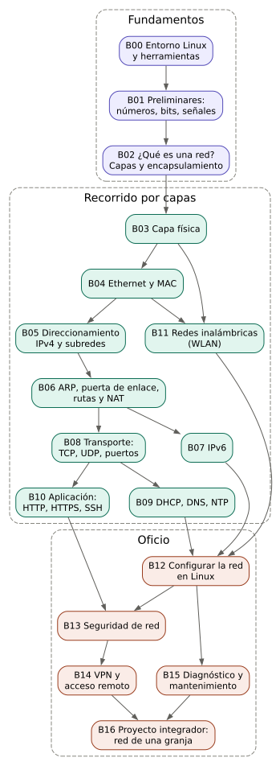

# Estructura del curso de redes

Temario completo del curso, organizado en 17 bloques y 5 anexos. La forma de escribir cada bloque está definida en [FILOSOFIA.md](FILOSOFIA.md).

## Mapa del curso



El curso tiene tres partes:

- **Fundamentos (B00–B02):** lo que el estudiante necesita antes de hablar de redes: manejar la terminal, pensar en binario y entender qué es una red y por qué se organiza en capas.
- **Recorrido por capas (B03–B11):** cada capa de abajo hacia arriba, con todos los términos que se configuran en un equipo real.
- **Oficio (B12–B16):** configurar, asegurar, acceder a distancia, diagnosticar y, al final, diseñar una red completa.

Duración sugerida: un semestre de 16 a 18 semanas, aproximadamente un bloque por semana. Los bloques 5 (subredes) y 6 (enrutamiento) suelen necesitar una semana extra cada uno.

## Estructura del repositorio

```
curso-redes/
├── README.md
├── FILOSOFIA.md              ← reglas de escritura y enfoque
├── ESTRUCTURA.md             ← este archivo
├── requirements.txt          ← dependencias para generar esquemas
├── bloques/
│   ├── _plantilla_bloque.md    ← esqueleto que sigue cada bloque
│   ├── bloque_00_entorno_linux.md
│   ├── bloque_01_preliminares.md
│   └── … hasta bloque_16_proyecto_integrador.md
├── anexos/
│   ├── anexo_A_glosario.md
│   └── … hasta anexo_E_estandares_rfc.md
└── recursos/
    ├── README.md
    ├── generar_recursos.sh   ← regenera todas las imágenes
    ├── esquemas/
    │   ├── graphviz/         ← fuentes .dot
    │   └── schemdraw/        ← fuentes .py
    └── imagenes/             ← SVG generados (se enlazan desde los bloques)
```

---

## Parte I — Fundamentos

### Bloque 00 — Entorno de trabajo en Linux

`bloques/bloque_00_entorno_linux.md`

**Objetivo:** que el estudiante pase de usuario de escritorio a usuario de terminal, lo justo para trabajar redes.

**Por qué va primero:** todas las herramientas de redes se usan desde la terminal. Sin esto, cada bloque tropieza.

**Temas:**
- Qué es la terminal, el intérprete de comandos (*shell*) y un comando. Estructura de un comando: nombre, opciones, argumentos.
- Moverse por el sistema de archivos: `pwd`, `ls`, `cd`, rutas absolutas y relativas.
- Leer y editar archivos de texto: `cat`, `less`, `nano`.
- Usuarios y permisos: qué es `root`, qué hace `sudo` y por qué la configuración de red lo exige.
- Instalar paquetes con el gestor de la distribución.
- Pedir ayuda: `man`, `--help`, `tldr`.
- Redirecciones y tuberías (`>`, `|`, `grep`) para filtrar salidas largas.
- Instalación del kit del curso: `iproute2`, `iputils`, `traceroute`, `mtr`, `dnsutils`/`bind-tools`, `nmap`, `netcat`, `tcpdump`, Wireshark.
- La bitácora de laboratorio: por qué se anota todo lo que se cambia.

**Laboratorio:** instalar el kit, ejecutar `ip addr` por primera vez y guardar la salida en la bitácora, sin interpretarla todavía.

**Esquemas:**
- [Anatomía de un comando](recursos/imagenes/anatomia_comando.svg) — `anatomia_comando.dot`
- [Árbol del sistema de archivos](recursos/imagenes/arbol_archivos.svg) — `arbol_archivos.dot`
- [Flujos estándar, redirecciones y tuberías](recursos/imagenes/tuberias_redirecciones.svg) — `tuberias_redirecciones.dot`

### Bloque 01 — Preliminares: números, bits y señales

`bloques/bloque_01_preliminares.md`

**Objetivo:** dar las herramientas matemáticas y físicas que el resto del curso usa todo el tiempo.

**Temas:**
- **Sistemas de numeración:** decimal, binario y hexadecimal. Por qué las máquinas usan binario y por qué los humanos usamos hexadecimal para abreviarlo. Conversiones entre los tres.
- **Bit, byte y octeto.** Por qué en redes se dice "octeto".
- **Potencias de 2** y su relación con cuántas combinaciones caben en *n* bits. Esta es la base de todo el direccionamiento.
- **Operaciones lógicas:** NOT, AND, OR, XOR, bit a bit. La operación AND es la clave de la máscara de red.
- **Unidades de velocidad y tamaño:** bit/s frente a byte/s, prefijos k, M, G decimales (1000) frente a Ki, Mi, Gi binarios (1024). Por qué "100 megas" de internet no descargan 100 MB por segundo.
- **Física de señales, lo mínimo:** voltaje, frecuencia, periodo, longitud de onda, velocidad de propagación, atenuación, ruido y el decibelio (dB y dBm).
- **Tiempos:** latencia, tiempo de transmisión y tiempo de propagación. Cálculo de cuánto tarda en llegar un archivo.

**Esquemas previstos:** tabla de potencias de 2, conversión binario-hexadecimal por nibbles, onda con amplitud y periodo.

### Bloque 02 — ¿Qué es una red y por qué se organiza en capas?

`bloques/bloque_02_que_es_una_red.md`

**Objetivo:** construir el mapa mental del curso antes de entrar en detalles.

**Temas:**
- Qué es comunicarse: emisor, receptor, medio, mensaje, **protocolo** (acuerdo sobre cómo hablar).
- **Equipo (*host*), nodo, interfaz, enlace.**
- Tipos de red por alcance: PAN, **LAN**, **WLAN**, MAN, WAN e internet como "red de redes".
- Topologías: bus, estrella, anillo, malla. Por qué hoy casi todo es estrella.
- Modelos de comunicación: cliente-servidor y par a par (*peer-to-peer*).
- Conmutación de circuitos frente a conmutación de paquetes: por qué internet parte la información en pedazos.
- **El problema que resuelven las capas:** dividir un problema enorme en problemas pequeños e independientes.
- **Modelo OSI** (7 capas) y **modelo TCP/IP** (4 capas): cuál se usa para pensar y cuál se usa en la práctica.
- **Encapsulamiento y PDU:** mensaje, segmento, paquete, trama, bits.
- Quién define las reglas: IETF y los RFC, IEEE y las normas 802, IANA y los registros de direcciones.
- Primer vistazo con Wireshark: abrir una página web y ver las capas de un paquete sin entenderlas todavía.

**Esquemas:**
- [Modelo OSI y TCP/IP](recursos/imagenes/capas_osi_tcpip.svg) — `capas_osi_tcpip.dot`
- [Encapsulamiento](recursos/imagenes/encapsulamiento.svg) — `encapsulamiento.dot`
- [Red típica pequeña](recursos/imagenes/red_domestica.svg) — `red_domestica.dot`

---

## Parte II — Recorrido por capas

### Bloque 03 — Capa física: cómo viaja un bit

`bloques/bloque_03_capa_fisica.md`

**Problema:** convertir unos y ceros en algo que cruce un cable, una fibra o el aire, y que llegue entendible.

**Temas:**
- Medios guiados: **cable de par trenzado** (UTP, FTP, STP), categorías Cat5e, Cat6 y Cat6A; cable coaxial; **fibra óptica** monomodo y multimodo.
- Medios no guiados: ondas de radio (introducción; se profundiza en B11).
- **Por qué se trenza el cable:** señal diferencial y rechazo del ruido electromagnético (EMI) y la diafonía (*crosstalk*).
- **Codificación de línea:** NRZ, Manchester y por qué el receptor necesita recuperar el reloj.
- Conectores: **RJ45**, normas **T568A y T568B**, cable directo y cruzado, Auto-MDIX.
- **Ancho de banda, velocidad de transmisión y rendimiento real** (*throughput*).
- **Dúplex:** simplex, half-duplex, full-duplex. Autonegociación.
- **PoE** (*Power over Ethernet*): alimentar equipos por el mismo cable.
- **Limitaciones:** 100 m en cobre, atenuación, interferencia cerca de motores y tableros eléctricos, radio de curvatura de la fibra.
- **Fallas típicas:** cable mal ponchado, par abierto, conector oxidado, negociación en half-duplex, cable que funciona a 100 Mb/s pero no a 1 Gb/s.

**Herramientas:** ponchadora, probador de cable, `ethtool`, `ip -s link` (contadores de errores).

**Laboratorio:** ponchar un cable, probarlo, forzar una mala conexión y observar la velocidad negociada y los errores.

**Esquemas:**
- [Señal NRZ frente a Manchester](recursos/imagenes/senal_nrz_manchester.svg) — `senal_nrz_manchester.py`
- [Cableado T568B](recursos/imagenes/cable_utp_t568b.svg) — `cable_utp_t568b.py`
- [Par trenzado y señal diferencial](recursos/imagenes/par_trenzado_diferencial.svg) — `par_trenzado_diferencial.py`

### Bloque 04 — Capa de enlace: Ethernet, MAC y switches

`bloques/bloque_04_ethernet_mac.md`

**Problema:** varios equipos comparten un medio. ¿Cómo sabe cada uno qué mensaje es para él y cómo se evita que hablen todos a la vez?

**Temas:**
- **Trama Ethernet:** preámbulo, direcciones, tipo, datos, FCS (detección de errores).
- **Dirección MAC:** 48 bits, formato hexadecimal, OUI (fabricante), unicast, multicast y **broadcast** (`ff:ff:ff:ff:ff:ff`). MAC aleatoria en celulares.
- **Hub frente a switch:** por qué el hub repite a todos y el switch aprende.
- **Tabla de direcciones MAC** del switch: aprendizaje, reenvío, inundación.
- **Dominio de colisión y dominio de broadcast.**
- **MTU** (tamaño máximo de trama) y tramas *jumbo*.
- **VLAN** (802.1Q): varias redes lógicas sobre un mismo switch. Puertos de acceso y troncales.
- **Bucles y STP** (*Spanning Tree Protocol*): por qué un cable de más puede tumbar toda la red.
- **Fallas típicas:** tormenta de broadcast por bucle, MAC duplicada, VLAN mal asignada.

**Herramientas:** `ip link`, `bridge fdb`, Wireshark (filtro `eth`), un switch administrable o un *bridge* de Linux.

**Laboratorio:** crear un switch virtual con un *bridge* de Linux y *network namespaces*, y ver cómo aprende las MAC.

**Esquemas previstos:** formato de la trama Ethernet, switch aprendiendo MAC paso a paso, VLAN sobre un switch.

### Bloque 05 — Direccionamiento IPv4, máscara y subredes

`bloques/bloque_05_ipv4_subredes.md`

**Problema:** la MAC identifica un equipo pero no dice dónde está. Hace falta una dirección que indique **a qué red pertenece** el equipo, como una dirección postal.

**Temas:**
- **Dirección IPv4:** 32 bits, notación decimal con puntos, octetos.
- Parte de **red** y parte de **equipo** (*host*).
- **Máscara de red:** qué es, por qué es una operación AND y cómo decide si un destino es local.
- **Notación CIDR** (`/24`, `/26`…) y su equivalencia con la máscara decimal.
- **Dirección de red, dirección de broadcast y rango de equipos utilizables.** Por qué se "pierden" dos direcciones.
- Clases A, B y C: qué eran y por qué se abandonaron.
- **Direcciones privadas** (RFC 1918) y **públicas**. Loopback (`127.0.0.1`), APIPA (`169.254.x.x`) y qué significa ver una de ellas.
- **Subnetting:** dividir una red en subredes más pequeñas. Método por bloques y método binario.
- **VLSM:** subredes de distintos tamaños según la necesidad.
- **Superredes y agregación** de rutas (introducción).
- **Fallas típicas:** máscara equivocada, dos equipos con la misma IP, equipo en otra subred sin saberlo.

**Herramientas:** `ip addr`, `ipcalc`, `sipcalc`.

**Laboratorio:** dividir la red de una granja en subredes para oficina, cámaras y sensores. Configurar mal una máscara y observar qué equipos dejan de verse.

**Esquemas:**
- [La máscara como AND bit a bit](recursos/imagenes/mascara_and.svg) — `mascara_and.py`

**Esquemas previstos:** estructura de una dirección IPv4 en bits, árbol de subredes (VLSM).

### Bloque 06 — ARP, puerta de enlace, enrutamiento y NAT

`bloques/bloque_06_arp_gateway_rutas_nat.md`

**Problema:** un equipo sabe la IP del destino. ¿Cómo averigua su MAC? ¿Y qué hace si el destino está en otra red?

**Temas:**
- **ARP:** traducir IP a MAC dentro de la red local. Tabla ARP y su caducidad.
- **Puerta de enlace predeterminada** (*default gateway*): el equipo al que se le entrega todo lo que no es de la red local.
- **Router:** equipo que une redes y decide por dónde mandar cada paquete.
- **Tabla de enrutamiento:** destino, máscara, siguiente salto, interfaz, métrica. Coincidencia del prefijo más largo.
- **Ruta por defecto** (`0.0.0.0/0`).
- **Enrutamiento estático** y nociones de **enrutamiento dinámico** (RIP, OSPF y BGP, solo para saber qué existen y por qué).
- **TTL** e **ICMP**: cómo funcionan `ping` y `traceroute` por dentro.
- **NAT y PAT:** muchas direcciones privadas saliendo por una sola pública. Por qué existe y qué rompe.
- **Reenvío de puertos** (*port forwarding*) y **CGNAT** (NAT del proveedor), y por qué con CGNAT no se puede recibir conexiones desde afuera.
- **Fallas típicas:** gateway mal configurado (hay red local pero no internet), rutas asimétricas, conflicto ARP.

**Herramientas:** `ip neigh`, `ip route`, `traceroute`, `mtr`, `ping`, Wireshark (filtros `arp`, `icmp`).

**Laboratorio:** un router Linux con dos interfaces uniendo dos subredes en *namespaces*; activar el reenvío de IP y NAT, y seguir un paquete con Wireshark.

**Esquemas:**
- [Dos subredes unidas por un router](recursos/imagenes/enrutamiento_dos_subredes.svg) — `enrutamiento_dos_subredes.dot`

**Esquemas previstos:** secuencia ARP, decisión "¿local o gateway?", traducción NAT.

### Bloque 07 — IPv6

`bloques/bloque_07_ipv6.md`

**Problema:** las direcciones IPv4 se acabaron. NAT fue un parche. IPv6 es la solución de fondo.

**Temas:**
- Por qué se agotó IPv4 y qué cambia con 128 bits.
- **Formato:** hexadecimal, grupos de 16 bits, reglas de abreviación (`::` y ceros a la izquierda).
- **Prefijo** y la convención del `/64` para redes locales.
- **Tipos de dirección:** *link-local* (`fe80::/10`), global (GUA), local única (ULA, `fd00::/8`), multicast. En IPv6 no hay broadcast.
- **Autoconfiguración SLAAC** y **DHCPv6**.
- **NDP** (*Neighbor Discovery*): reemplaza a ARP.
- Extensiones de privacidad (direcciones temporales).
- **Doble pila** (*dual stack*) y convivencia con IPv4.
- **Fallas típicas:** red con IPv6 a medias, firewall que solo protege IPv4.

**Herramientas:** `ip -6 addr`, `ip -6 route`, `ip -6 neigh`, `ping -6`.

**Esquemas previstos:** estructura de una dirección IPv6, proceso SLAAC.

### Bloque 08 — Capa de transporte: TCP, UDP y puertos

`bloques/bloque_08_transporte.md`

**Problema:** el paquete llega al equipo, pero en el equipo corren muchos programas. ¿A cuál va? ¿Y qué pasa si se pierde un pedazo?

**Temas:**
- **Puerto:** número que identifica a un programa dentro del equipo. Puertos bien conocidos, registrados y dinámicos.
- **Socket:** IP + puerto + protocolo.
- **UDP:** enviar sin garantías. Cuándo conviene (DNS, voz, video, sensores).
- **TCP:** conexión confiable. Saludo en tres pasos (*three-way handshake*), números de secuencia, confirmaciones (ACK), retransmisión, control de flujo (ventana) y de congestión, cierre de conexión.
- **Estados de una conexión TCP** (LISTEN, ESTABLISHED, TIME_WAIT…).
- Cómo se conecta todo: la dirección completa de una comunicación (IP de origen y destino, puertos de origen y destino).
- **Fallas típicas:** puerto cerrado frente a puerto filtrado, servicio escuchando solo en `127.0.0.1`.

**Herramientas:** `ss -tulpn`, `nc`, `nmap`, Wireshark (filtros `tcp`, `udp`, *Follow TCP stream*).

**Laboratorio:** abrir un servidor con `nc`, conectarse desde otro equipo y capturar el saludo TCP.

**Esquemas previstos:** saludo en tres pasos, comparación TCP/UDP.

### Bloque 09 — Servicios de infraestructura: DHCP, DNS y NTP

`bloques/bloque_09_dhcp_dns_ntp.md`

**Problema:** configurar a mano cada equipo es inviable, y las personas no recuerdan números.

**Temas:**
- **DHCP:** proceso DORA (Discover, Offer, Request, Acknowledge), concesión (*lease*), renovación, **reservas** por MAC, qué parámetros entrega (IP, máscara, gateway, DNS). Por qué los servidores llevan IP fija o reserva.
- **DNS:** para qué existe, espacio de nombres jerárquico (raíz, TLD, dominio), servidores autoritativos, resolvedores recursivos, caché y **TTL**.
- **Tipos de registro:** A, AAAA, CNAME, MX, TXT, NS, PTR (resolución inversa).
- El orden de resolución en Linux: `/etc/hosts`, `/etc/resolv.conf`, `systemd-resolved`, `/etc/nsswitch.conf`.
- DNS local para la red propia y bloqueo de publicidad (dnsmasq, Pi-hole).
- **NTP:** por qué la hora exacta importa (certificados, registros, bases de datos).
- **Fallas típicas:** "hay internet pero no abre páginas" (DNS), dos servidores DHCP en la misma red, reloj desfasado que invalida HTTPS.

**Herramientas:** `dig`, `nslookup`, `resolvectl`, `dnsmasq`, `chronyc`.

**Laboratorio:** montar dnsmasq como DHCP y DNS de una red virtual. Crear un servidor DHCP "intruso" y observar el caos.

**Esquemas:**
- [Proceso DHCP DORA](recursos/imagenes/dhcp_dora.svg) — `dhcp_dora.dot`
- [Resolución DNS](recursos/imagenes/resolucion_dns.svg) — `resolucion_dns.dot`

### Bloque 10 — Capa de aplicación: HTTP, HTTPS y SSH

`bloques/bloque_10_aplicacion.md`

**Problema:** ya llegan los datos al programa correcto. ¿Cómo se ponen de acuerdo un navegador y un servidor, y cómo se evita que otros lean lo que se envía?

**Temas:**
- **URL:** esquema, dominio, puerto, ruta, parámetros.
- **HTTP:** petición y respuesta, métodos (GET, POST…), códigos de estado (200, 301, 404, 500…), cabeceras. HTTP/1.1, HTTP/2 y HTTP/3 (solo qué cambia).
- **Por qué HTTP no basta:** cualquiera en el camino puede leer y modificar.
- **Criptografía mínima:** cifrado simétrico y asimétrico, hash, firma digital, explicados sin matemática avanzada.
- **TLS y HTTPS:** saludo TLS, **certificados**, autoridades certificadoras (CA), cadena de confianza, Let's Encrypt.
- **SSH:** acceso remoto cifrado, claves pública y privada, `known_hosts`, túneles.
- Otros protocolos que se encontrarán: correo (SMTP, IMAP), FTP/SFTP, MQTT para sensores.
- **Fallas típicas:** certificado vencido, nombre que no coincide con el certificado, reloj desfasado.

**Herramientas:** `curl -v`, `openssl s_client`, `ssh`, `ssh-keygen`, herramientas de desarrollador del navegador.

**Esquemas previstos:** petición y respuesta HTTP, saludo TLS simplificado, cadena de certificados.

### Bloque 11 — Redes inalámbricas (WLAN)

`bloques/bloque_11_wlan.md`

**Problema:** llevar la red a donde no llega un cable: celulares, sensores, galpones.

**Temas:**
- Radio en lo mínimo: frecuencia, potencia (dBm), atenuación con la distancia y con obstáculos, reflexión, zona de Fresnel.
- Normas **802.11** (Wi-Fi 4, 5, 6, 6E, 7): qué cambia entre ellas.
- **Bandas de 2.4, 5 y 6 GHz** y **canales**: alcance frente a velocidad, canales que no se solapan.
- **SSID, BSSID**, punto de acceso (*access point*) frente a router inalámbrico.
- Modos: infraestructura, ad hoc, repetidor, **malla** (*mesh*), puente inalámbrico punto a punto.
- **Seguridad:** WEP (roto), WPA2, WPA3, clave compartida frente a empresarial.
- Itinerancia (*roaming*) entre puntos de acceso.
- Wi-Fi para dispositivos de bajo consumo (ESP32) y alternativas: LoRa, Zigbee (solo para ubicarlas).
- **Limitaciones:** interferencia, paredes y techos metálicos, equipos que no pasan de 2.4 GHz.
- **Fallas típicas:** canal saturado, señal débil, clave equivocada, equipo que se conecta al punto de acceso lejano.

**Herramientas:** `iw`, `nmcli`, `wavemon`, analizador Wi-Fi en Android.

**Laboratorio:** levantar un mapa de cobertura (*site survey*) de una instalación y elegir canales.

**Esquemas previstos:** canales de 2.4 GHz y su solapamiento, enlace punto a punto con zona de Fresnel.

---

## Parte III — Oficio

### Bloque 12 — Configurar la red en Linux

`bloques/bloque_12_configuracion_linux.md`

**Objetivo:** juntar todos los parámetros vistos y configurarlos con criterio.

**Temas:**
- **Los cuatro datos de toda interfaz:** IP, máscara, puerta de enlace, DNS. Qué decide cada uno.
- IP fija frente a DHCP frente a reserva DHCP: cuándo usar cada una.
- Cambios temporales con `ip` frente a configuración permanente.
- **NetworkManager** (`nmcli`, `nmtui`): escritorios y portátiles.
- **systemd-networkd** y **Netplan** (Ubuntu Server).
- Nombre del equipo (*hostname*) y `/etc/hosts`.
- Varias interfaces, prioridad de rutas y métrica.
- Interfaces virtuales: *bridge*, VLAN, *bond*.
- **Fallas típicas:** dos gestores de red peleando por la misma interfaz, configuración que se pierde al reiniciar.

**Laboratorio:** configurar un servidor con IP fija por Netplan y un portátil con `nmcli`. Romper cada uno de los cuatro datos, uno por uno, y anotar el síntoma de cada falla.

### Bloque 13 — Seguridad de red

`bloques/bloque_13_seguridad.md`

**Temas:**
- Superficie de ataque: qué está expuesto y a quién.
- **Firewall:** filtrado por estado, políticas por defecto, reglas de entrada y salida. `nftables` y `ufw`.
- Escaneo de la propia red con `nmap` para saber qué se ve desde afuera.
- **Segmentación:** VLAN para separar oficina, cámaras y dispositivos IoT.
- Buenas prácticas: cambiar credenciales por defecto, actualizar firmware, desactivar lo que no se usa (UPnP, WPS).
- Ataques típicos para reconocerlos: suplantación ARP, DHCP falso, DNS falso, fuerza bruta a SSH. Solo a nivel de comprensión y defensa.
- Contraseñas, claves SSH y *fail2ban*.

**Esquemas previstos:** red segmentada por VLAN con firewall entre segmentos.

### Bloque 14 — VPN y acceso remoto

`bloques/bloque_14_vpn_acceso_remoto.md`

**Temas:**
- Qué es un **túnel** y qué es una **VPN**.
- **WireGuard:** claves, pares (*peers*), `AllowedIPs`.
- **Tailscale:** red en malla sobre WireGuard, *subnet router*, *exit node*.
- **Cloudflare Tunnel:** publicar servicios web sin abrir puertos.
- Túneles SSH: redirección local, remota y dinámica.
- **Escritorio remoto:** VNC, RDP, Sunshine/Moonlight. Diferencias entre X11 y Wayland.
- Por qué no se deben abrir puertos de administración directamente a internet.

**Esquemas previstos:** subnet router de Tailscale accediendo a una LAN, comparación VPN frente a túnel web.

### Bloque 15 — Diagnóstico y mantenimiento

`bloques/bloque_15_diagnostico.md`

**Objetivo:** convertir todo lo anterior en un método para resolver fallas.

**Temas:**
- **Método por capas:** de abajo hacia arriba (y cuándo conviene de arriba hacia abajo).
- Recolección de síntomas: qué funciona, qué no, desde cuándo, qué cambió.
- Uso de Wireshark y `tcpdump` para confirmar hipótesis.
- Medición de rendimiento: `iperf3`, `mtr`, pruebas de velocidad.
- **Documentación de la red:** diagrama, tabla de direcciones, inventario de equipos, credenciales guardadas de forma segura.
- Mantenimiento preventivo: firmware, respaldos de configuración, revisión de cableado y conectores, registros.
- Catálogo de casos reales con síntoma, hipótesis, prueba y solución.

**Esquemas:**
- [Flujo de diagnóstico por capas](recursos/imagenes/flujo_diagnostico.svg) — `flujo_diagnostico.py`

### Bloque 16 — Proyecto integrador: la red de una granja

`bloques/bloque_16_proyecto_integrador.md`

**Objetivo:** diseñar, montar, documentar y dejar lista para mantenimiento una red real.

**Caso:** granja con oficina, dos galpones separados, cámaras, sensores ESP32, un servidor local y necesidad de acceso remoto desde el celular.

**Entregables:**
1. Levantamiento de necesidades: equipos, ubicaciones, distancias, qué necesita hablar con qué.
2. Diseño físico: cableado, enlaces inalámbricos entre edificios, ubicación de puntos de acceso, protección contra rayos y humedad.
3. Plan de direccionamiento: subredes o VLAN por función, IPs fijas, reservas DHCP.
4. Servicios: DHCP, DNS local, NTP.
5. Seguridad: firewall entre segmentos, credenciales, actualizaciones.
6. Acceso remoto seguro.
7. Documentación completa y plan de mantenimiento.
8. Prueba de fallas: se provocan cinco fallas y se diagnostican con el método del bloque 15.

---

## Anexos

| Anexo | Archivo | Contenido |
|---|---|---|
| A | `anexos/anexo_A_glosario.md` | Glosario general: cada término con definición llana, definición técnica y bloque donde se estudia. |
| B | `anexos/anexo_B_comandos.md` | Referencia rápida de comandos de red en Linux, agrupados por capa. |
| C | `anexos/anexo_C_laboratorio_virtual.md` | Cómo montar laboratorios con *network namespaces*, GNS3, containerlab y Packet Tracer. |
| D | `anexos/anexo_D_tablas.md` | Tablas de consulta: potencias de 2, máscaras y CIDR, puertos comunes, canales Wi-Fi, colores T568A/B. |
| E | `anexos/anexo_E_estandares_rfc.md` | Estándares y RFC citados en el curso, con una línea sobre qué define cada uno. |

## Índice de términos por bloque

Para verificar que ningún término quede sin su lugar:

| Término | Bloque |
|---|---|
| Bit, byte, octeto, binario, hexadecimal | 01 |
| Protocolo, LAN, WLAN, WAN, OSI, TCP/IP, encapsulamiento | 02 |
| UTP, fibra, RJ45, T568A/B, dúplex, PoE, ancho de banda | 03 |
| MAC, trama, switch, broadcast, MTU, VLAN, STP | 04 |
| IPv4, máscara de red, CIDR, subred, IP privada/pública | 05 |
| ARP, puerta de enlace, router, ruta, TTL, ICMP, NAT | 06 |
| IPv6, link-local, SLAAC, NDP | 07 |
| Puerto, socket, TCP, UDP | 08 |
| DHCP, DNS, registros DNS, NTP | 09 |
| URL, HTTP, HTTPS, TLS, certificado, SSH | 10 |
| SSID, canal, banda, WPA2/WPA3, punto de acceso | 11 |
| Firewall, segmentación | 13 |
| VPN, túnel, WireGuard | 14 |
