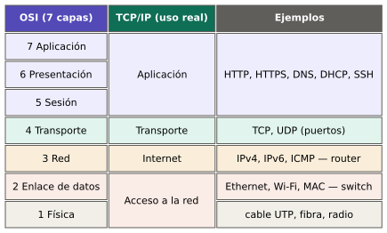
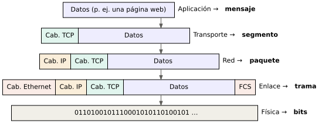

# Filosofía del curso de redes

Este documento fija las reglas con las que se escribe cada bloque del curso. Si un bloque contradice algo de aquí, se corrige el bloque.

## 1. A quién va dirigido

El estudiante tipo cursa tercer semestre de ingeniería. Sabe álgebra, algo de cálculo y física general (electricidad básica, ondas). Usa Linux como usuario: prende y apaga el equipo, actualiza el sistema, navega, usa ofimática.

**No se asume nada más.** No se asume que sabe qué es una terminal, qué es binario, qué es un protocolo ni qué significa "IP". El curso debe poder leerse de principio a fin sin buscar términos por fuera.

## 2. Principio central: entender por qué existe cada cosa

Cada concepto de redes existe porque resuelve un problema concreto. Por eso el curso no presenta un término hasta que el estudiante siente el problema que lo hace necesario.

- La **dirección MAC** aparece cuando varios equipos comparten un cable y hay que saber a quién va cada mensaje.
- La **dirección IP** aparece cuando la MAC ya no alcanza, porque no dice nada sobre *dónde* está un equipo.
- La **máscara de red** aparece cuando un equipo necesita decidir si el destino está en su misma red o si debe enviarlo a otro lado.
- La **puerta de enlace** aparece como la respuesta a "¿y a quién le entrego lo que no es de mi red?".
- El **DNS** aparece cuando recordar números se vuelve imposible para las personas.

Para cada concepto el curso responde cuatro preguntas:

1. **¿Qué problema resuelve?**
2. **¿Cómo funciona por dentro?** (el mecanismo)
3. **¿Cómo se aplica y se configura en la vida real?**
4. **¿Dónde más aparece esta idea?** (la misma idea en otros protocolos, en electrónica, en control, en la vida cotidiana)

## 3. Ningún término sin definir

- Todo término técnico se define **la primera vez que aparece**, en lenguaje llano, antes de dar la definición formal.
- Se usa primero una **analogía** y luego se dice **dónde falla la analogía**. Las analogías ayudan a entrar, pero no deben quedarse como modelo mental definitivo.
- Las siglas se expanden siempre la primera vez: DHCP (*Dynamic Host Configuration Protocol*, protocolo de configuración dinámica de equipos).
- Cada bloque termina con un **glosario del bloque**, y todos alimentan el glosario general (Anexo A).
- Si un bloque necesita un término de un bloque posterior, se da una definición mínima y se indica dónde se profundiza. Nunca se usa un término "que ya se verá" sin explicarlo.

## 4. Las capas como columna vertebral

Las redes se estudian **por capas**, de abajo hacia arriba: primero cómo viaja un bit por un cable o por el aire, luego cómo se entrega una trama dentro de una red local, luego cómo un paquete cruza varias redes, y así hasta la aplicación.

Cada capa se trata como un **bloque tipo Lego**: tiene una función, recibe algo de la capa de arriba, le pone su propia información (encapsulamiento) y se lo pasa a la de abajo. Entender una red es entender cómo se encajan esas piezas.

El modelo por capas también es la herramienta de diagnóstico: cuando algo falla se revisa capa por capa, de abajo hacia arriba.

## 5. Estructura fija de cada tema

Dentro de cada bloque, cada tema sigue este orden:

1. **El problema.** Una situación concreta donde falta la pieza.
2. **El mecanismo.** Cómo funciona, con esquema.
3. **En la vida real.** Cómo se ve en un equipo real: dónde se configura, qué muestra un comando, cómo se ve en Wireshark.
4. **Limitaciones.** Hasta dónde llega: distancias, cantidades, velocidades, supuestos que se rompen.
5. **Fallas típicas y diagnóstico.** Qué síntomas produce cuando está mal, cómo se detecta y cómo se corrige. Este punto es obligatorio, no opcional: el curso forma a alguien capaz de **mantener** una red, no solo de montarla.
6. **Dónde más aparece la idea.**
7. **Ejemplos resueltos.**
8. **Ejercicios propuestos**, en tres series:
   - **Serie A — Conceptuales:** explicar con palabras propias, predecir qué pasa.
   - **Serie B — Cálculo:** binario, subredes, tiempos, capacidades.
   - **Serie C — Laboratorio:** práctica con herramientas reales o simuladas.

## 6. Primero entender, luego configurar

Configurar es escribir cuatro números en una casilla. Lo difícil es saber **por qué** esos números y **qué pasa si uno está mal**. Por eso:

- Ningún parámetro de configuración (IP, máscara, puerta de enlace, DNS, SSID, canal, puerto) se presenta como "ponga esto aquí". Siempre se explica qué decide ese parámetro.
- Cada parámetro que se configura se acompaña de un ejercicio de **"romperlo a propósito"**: se configura mal y se observa el síntoma. Así el estudiante aprende a reconocer la falla cuando le ocurra de verdad.

## 7. Herramientas reales y libres

Todo el curso se trabaja en **Linux con software libre**. Las herramientas son las mismas que se usan en el trabajo real:

| Propósito | Herramientas |
|---|---|
| Ver y configurar interfaces | `ip`, `nmcli`, `ethtool`, `iw` |
| Probar conectividad | `ping`, `traceroute`, `mtr` |
| Ver conexiones y puertos | `ss`, `nc`, `nmap` |
| Nombres y servicios | `dig`, `dnsmasq`, `curl`, `openssl` |
| Ver el tráfico por dentro | Wireshark, `tcpdump` |
| Laboratorio virtual | *network namespaces* de Linux, GNS3, containerlab, Cisco Packet Tracer |

Wireshark es la herramienta central del curso: permite **ver** cada capa en un paquete real y conecta la teoría con lo que de verdad viaja por la red.

## 8. Del mecanismo general a la aplicación real

El orden va de lo general a lo concreto y termina en un **proyecto integrador**: diseñar, documentar, configurar y dejar lista para mantenimiento la red de una granja real, con oficina, galpones, sensores y acceso remoto.

## 9. Convenciones de escritura

- **Idioma:** español. Los términos en inglés se dan entre paréntesis y en cursiva la primera vez, porque son los que aparecen en documentación, equipos y comandos.
- **Archivos:** un archivo Markdown por bloque, en `bloques/`, con nombre `bloque_NN_tema.md`. Los anexos van en `anexos/` como `anexo_X_tema.md`.
- **Imágenes y esquemas:** todos en `recursos/`. El código fuente de cada esquema (Graphviz `.dot` o Python con schemdraw) se guarda junto al resto de esquemas y la imagen generada va en `recursos/imagenes/`. Nunca se sube una imagen sin su fuente. Ver `recursos/README.md`.
- **Comandos:** en bloques de código. `$` indica usuario normal y `#` indica que se requiere `sudo`. Siempre se muestra también la salida esperada y se explica cómo leerla.
- **Direcciones de ejemplo:** para direcciones públicas se usan los rangos reservados para documentación: `192.0.2.0/24`, `198.51.100.0/24`, `203.0.113.0/24` en IPv4 y `2001:db8::/32` en IPv6. Para redes locales se usan rangos privados (`192.168.x.x`, `10.x.x.x`). Nunca se publican direcciones, claves ni nombres de redes reales.
- **Matemática:** en notación LaTeX de GitHub (`$...$` y `$$...$$`), solo cuando aporta. El curso usa aritmética binaria y potencias de 2, no cálculo avanzado.
- **Referencias:** cuando un tema está definido por un estándar, se cita el RFC o la norma IEEE correspondiente. El estudiante aprende a leer la fuente original.
