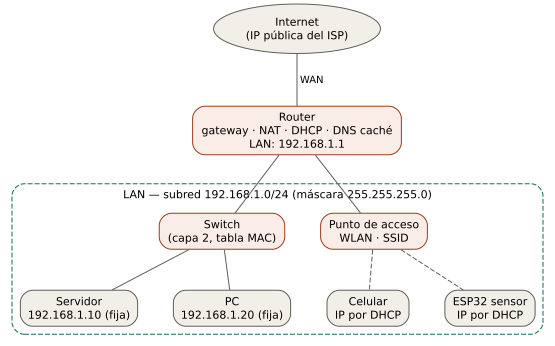

# Curso de redes desde cero

Curso de redes de computadores en español para estudiantes de ingeniería que no traen conocimientos previos de redes. Parte de lo que sabe un estudiante de tercer semestre (álgebra, física general y uso básico de Linux) y llega hasta diseñar, configurar, asegurar y mantener una red real.



**Por dónde empezar:** [Bloque 00 — Entorno de trabajo en Linux](bloques/bloque_00_entorno_linux.md).

## Cómo está organizado

- [FILOSOFIA.md](FILOSOFIA.md) — el enfoque del curso y las reglas con que se escribe cada bloque.
- [ESTRUCTURA.md](ESTRUCTURA.md) — el temario completo: 17 bloques y 5 anexos.
- `bloques/` — un archivo Markdown por bloque, más `_plantilla_bloque.md`.
- `anexos/` — glosario, comandos, laboratorio virtual, tablas y estándares.
- `recursos/` — esquemas (fuentes en Graphviz y schemdraw), imágenes generadas y estilo del PDF.
- `export_pdf.sh` — exporta los bloques y el libro completo a PDF.

## Requisitos para trabajar el curso

Un equipo con Linux. Las herramientas se instalan en el bloque 00.

## Regenerar los esquemas

```bash
# Graphviz desde el gestor de paquetes (apt, pacman, dnf…)
sudo apt install graphviz          # Debian/Ubuntu
sudo pacman -S graphviz            # Arch

# schemdraw y matplotlib en un entorno virtual (el Python del sistema suele
# estar protegido por PEP 668)
python3 -m venv .venv
.venv/bin/pip install -r requirements.txt

./recursos/generar_recursos.sh         # solo SVG (lo que se versiona)
./recursos/generar_recursos.sh --pdf   # además PDF vectorial, para el PDF del curso
```

`generar_recursos.sh` usa `.venv/bin/python` si existe; si no, el `python3` del sistema. La salida es reproducible: regenerar sin cambiar las fuentes no modifica los SVG (se fija `svg.hashsalt` y la fecha de los metadatos en `recursos/esquemas/schemdraw/_comun.py`).

---

## Exportar a PDF

Todo el curso está en Markdown con LaTeX, pensado para leerse en GitHub y exportarse a PDF. La exportación usa **los mismos parámetros que los cursos hermanos** ([robotica](https://github.com/eamadosuarez83/robotica) y [curso-control](https://github.com/eamadosuarez83/curso-control)), de modo que los tres libros se ven iguales.

### Comando

```bash
./export_pdf.sh                           # cada bloque por separado + el libro completo
./export_pdf.sh bloque_00_entorno_linux   # solo ese bloque (nombre de archivo sin .md)
```

Los PDF quedan en `pdf/`, que git ignora: no se versiona el binario, solo el Markdown y los SVG. El libro completo es `pdf/curso_redes_completo.pdf` y reúne, en orden, `FILOSOFIA.md`, `ESTRUCTURA.md`, los bloques y los anexos, con índice.

### Herramientas

| Herramienta | Versión probada | Para qué |
|---|---|---|
| [Pandoc](https://pandoc.org/) | 3.10.2 (mínimo 3.5 para el ajuste de figuras) | Convierte el Markdown a LaTeX y lo compila. |
| TeX Live con **LuaLaTeX** | TeX Live 2026, LuaHBTeX 1.24 | Motor PDF. No XeLaTeX: los emoji (⚠, ✓, ✗) y el respaldo automático de fuente solo compilan limpio con LuaLaTeX. |
| Graphviz (`dot`) | 16.0.0 | Esquemas `.dot` → SVG y PDF. |
| schemdraw + matplotlib | 0.23 / 3.11.2 (en `.venv/`) | Esquemas `.py` → SVG y PDF. |

Instalación en Arch/Manjaro:

```bash
sudo pacman -S pandoc-cli texlive-basic texlive-latex texlive-latexrecommended \
  texlive-latexextra texlive-luatex texlive-fontsrecommended \
  ttf-dejavu noto-fonts-emoji graphviz
```

En Debian/Ubuntu:

```bash
sudo apt install pandoc texlive-luatex texlive-latex-extra \
  fonts-dejavu fonts-noto-color-emoji graphviz
```

### Fuentes y formato de página

| Parámetro | Valor |
|---|---|
| Motor | `--pdf-engine=lualatex` |
| Idioma | `-V lang=es` (separación silábica, "Figura", "Índice") |
| Clase de documento | `-V documentclass=report` |
| Márgenes | `-V geometry:margin=2.5cm` (tamaño de papel por defecto de LaTeX) |
| Texto | `-V mainfont="DejaVu Serif"` |
| Código y comandos | `-V monofont="DejaVu Sans Mono"` (cubre los caracteres de dibujo `│└┬┘` usados en diagramas de texto) |
| Respaldo para emoji | `-V mainfontfallback="Noto Color Emoji:mode=harf"` y `-V monofontfallback="Noto Color Emoji:mode=harf"` |
| Índice | `--toc`, solo en el libro completo |

### Cómo trabaja `export_pdf.sh`

1. **Regenera las figuras** con `recursos/generar_recursos.sh --pdf`: cada `.dot` y cada `.py` produce `recursos/imagenes/nombre.svg` y `recursos/imagenes/nombre.pdf`. LuaLaTeX no incrusta SVG, por eso hace falta la versión PDF (vectorial, también ignorada por git).
2. **Hace una copia temporal** de cada Markdown (`.build-*.md`) cambiando las rutas `recursos/imagenes/*.svg` por `*.pdf`. Los originales no se tocan.
3. **Compila** la copia con pandoc y los parámetros de la tabla, más dos ajustes propios de este curso (en `recursos/pdf/`):
   - `detalles.lua` — filtro de pandoc. En GitHub las respuestas de la serie B van plegadas en `<details><summary>…</summary>`; LaTeX descarta ese HTML y el título se perdería. El filtro lo convierte en un párrafo en negrita (**Respuestas de la serie B**) y deja el contenido visible.
   - `estilo.tex` — se inyecta con `-H`. Limita la altura de cada figura al 85 % del alto del texto, para que las figuras muy altas (el mapa del curso) quepan junto con su pie. Las pequeñas conservan su tamaño natural.
4. Borra las copias temporales.

En esencia, para un bloque:

```bash
pandoc bloques/.build-bloque_00_entorno_linux.md \
  -o pdf/bloque_00_entorno_linux.pdf \
  --resource-path=.:bloques:anexos \
  --pdf-engine=lualatex \
  -V lang=es \
  -V geometry:margin=2.5cm \
  -V mainfont="DejaVu Serif" \
  -V monofont="DejaVu Sans Mono" \
  -V mainfontfallback="Noto Color Emoji:mode=harf" \
  -V monofontfallback="Noto Color Emoji:mode=harf" \
  -V documentclass=report \
  --lua-filter=recursos/pdf/detalles.lua \
  -H recursos/pdf/estilo.tex
```

### Estilo de las figuras

Las figuras siguen la paleta común del curso (ver [recursos/README.md](recursos/README.md)): morado `#534AB7`, verde `#0F6E56`, coral `#993C1D` y gris `#5F5E5A`, con texto en DejaVu Sans y DejaVu Sans Mono, las mismas familias del PDF.

### Notas técnicas

> **`--resource-path`:** pandoc resuelve las rutas de imagen contra su directorio de trabajo, no contra la carpeta del `.md`. Los bloques enlazan `../recursos/imagenes/…` y los archivos de la raíz `recursos/imagenes/…`; por eso se le dan ambas bases (`.:bloques:anexos`). Sin eso, LuaLaTeX no encuentra las figuras.

> **Una sola fuente de respaldo:** si un símbolo nuevo no lo cubre DejaVu ni Noto Color Emoji, no se agrega una segunda fuente a `mainfontfallback`/`monofontfallback`: mezclar una fuente de color con una normal rompe `luaotfload.add_fallback`. Se cambia el carácter por uno equivalente que sí esté cubierto.

> **Pandoc y `\pandocbounded`:** desde pandoc 3.5 las imágenes se escalan con la macro `\pandocbounded` (antes con `\maxheight`). `estilo.tex` la redefine solo si existe; con una versión anterior, o si una versión futura de pandoc cambia el nombre, el aviso `Float too large for page` vuelve a aparecer en el mapa del curso.

---

## Estado

| Parte | Estado |
|---|---|
| Filosofía y temario | Listo |
| Esquemas base | 15 de los previstos |
| Bloque 00 — Entorno Linux | Listo |
| Bloques 01–16 | Por escribir |
| Anexos A–E | Por escribir |
| Exportación a PDF | Lista (`./export_pdf.sh`) |
