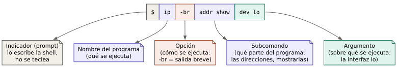
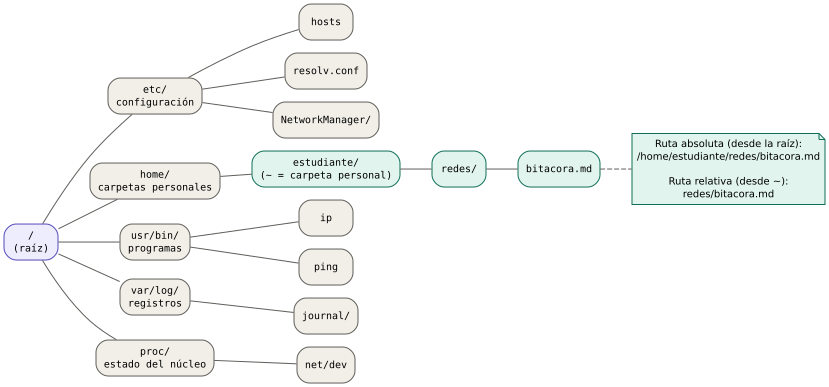
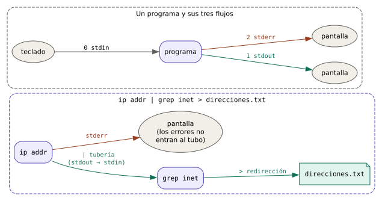

# Bloque 00 — Entorno de trabajo en Linux

> **Problema que abre el bloque:** todas las herramientas con que se mira, se configura y se repara una red se usan escribiendo órdenes en una ventana de texto. Quien no se siente cómodo en esa ventana tropieza en cada bloque del curso, no por no entender redes, sino por no saber dónde escribir, qué significa un mensaje de error o por qué el sistema le dice "permiso denegado".
>
> **Necesitas antes:** nada. Solo saber encender un equipo con Linux y abrir programas desde el menú. · **Referencias:** *Filesystem Hierarchy Standard* 3.0 (Linux Foundation, 2015); manual de Bash (`man bash`).

## Cómo leer este bloque

Este bloque no es de redes todavía. Es el taller donde se consiguen y se aprenden a usar las herramientas. Al terminarlo, el estudiante podrá:

- abrir una terminal, escribir un comando y leer lo que responde;
- moverse entre carpetas y encontrar los archivos de configuración de red;
- leer y editar un archivo de texto sin salir de la terminal;
- entender por qué la configuración de red pide `sudo` y usarlo con cuidado;
- buscar ayuda sobre cualquier comando sin salir a internet;
- filtrar salidas largas para quedarse solo con la línea que importa;
- instalar el kit de herramientas del curso;
- llevar una bitácora de laboratorio.

**Convenciones que se usan en todo el curso** (fijadas en [FILOSOFIA.md](../FILOSOFIA.md)):

- Un comando que empieza con `$` se escribe como usuario normal. Uno que empieza con `#` necesita permisos de administrador (se verá qué significa en el tema 0.4). El `$` o el `#` **no se escriben**: los pone la terminal.
- Debajo de cada comando se muestra la salida esperada. En el equipo de cada estudiante los números y nombres cambian; lo que importa es la forma.
- **⚠ Romperlo a propósito:** en cada tema hay al menos un ejercicio que provoca un error a propósito, para reconocerlo cuando aparezca solo.

Las salidas de ejemplo están en español, que es como las muestra un sistema configurado en español. Algunos programas (como `ip`) muestran sus mensajes siempre en inglés; en ese caso se traduce al lado.

---

## Tema 0.1 — La terminal, la *shell* y el comando

### 1. El problema

En el escritorio, para saber qué dirección tiene el equipo en la red, se abre la configuración, se entra a "Red", se da clic en la conexión, se busca un engranaje… y el camino cambia de una distribución a otra y de una versión a la siguiente. Además, el panel gráfico muestra solo lo que su diseñador decidió mostrar.

Un técnico de redes necesita tres cosas que el panel no da: **ver todo** lo que el sistema sabe, **hacer lo mismo en cualquier equipo** (incluidos servidores sin pantalla y equipos a los que se entra a distancia) y **repetir y anotar** exactamente lo que hizo. La terminal da las tres.

### 2. El mecanismo

Hay tres piezas que en el habla diaria se confunden:

- **Terminal** (o emulador de terminal): la ventana. Es un programa que solo sabe mostrar texto y recibir teclas. En los escritorios se llama Konsole, GNOME Terminal, Terminal de XFCE, Alacritty, Kitty… Todas hacen lo mismo.
- **Intérprete de comandos** (*shell*): el programa que corre **dentro** de la ventana. Lee lo que se escribe, lo interpreta y ejecuta el programa pedido. La más común es **Bash**; otra muy usada es **Zsh**. Para este curso se comportan igual.
- **Comando:** la orden escrita. Casi siempre es el nombre de un programa, seguido de datos que le dicen cómo y sobre qué trabajar.

*Analogía:* la terminal es el teléfono, la *shell* es la recepcionista que contesta y el comando es lo que se le pide. **Dónde falla la analogía:** la recepcionista entiende pedidos vagos; la *shell* no. Hace exactamente lo que se escribe, letra por letra, distinguiendo mayúsculas de minúsculas, y no pregunta si se está seguro.

**Estructura de un comando.** Un comando se lee de izquierda a derecha y sus partes se separan con espacios:



| Parte | Qué decide | Ejemplo |
|---|---|---|
| Nombre | qué programa se ejecuta | `ip` |
| Subcomando (no todos lo tienen) | qué parte del programa se usa | `addr show` |
| Opciones | cómo se ejecuta. Empiezan con `-` (forma corta, una letra) o `--` (forma larga, una palabra) | `-br`, `--color` |
| Argumentos | sobre qué se ejecuta | `dev lo`, un nombre de archivo |

**Indicador** (*prompt*): el texto que la *shell* muestra antes del cursor, como `estudiante@portatil:~$`. Dice quién es el usuario (`estudiante`), en qué equipo está (`portatil`), en qué carpeta está (`~`, la carpeta personal) y si es usuario normal (`$`) o administrador (`#`). Leerlo antes de escribir evita la mitad de los errores del curso: ejecutar algo en el equipo equivocado o con el usuario equivocado.

Cuando la *shell* recibe la tecla Enter, hace esto:

1. Parte la línea en palabras separadas por espacios.
2. Toma la primera palabra y busca un programa con ese nombre en una lista de carpetas llamada `PATH` (por ejemplo `/usr/bin`).
3. Ejecuta el programa y le entrega el resto de palabras.
4. Muestra lo que el programa escriba y, cuando termina, vuelve a mostrar el indicador.

Si no encuentra el programa, responde `command not found` (orden no encontrada).

### 3. En la vida real

Se abre la terminal desde el menú del escritorio (buscar "terminal") o con el atajo que traiga la distribución, a menudo `Ctrl+Alt+T`.

```console
$ whoami
estudiante
$ hostname
portatil
$ date
mar 22 sep 2026 10:14:03 -05
```

`whoami` responde con qué usuario se está trabajando, `hostname` el nombre del equipo en la red y `date` la fecha y hora del sistema (la hora exacta importa mucho en redes, se verá en el Bloque 09).

El primer comando de redes del curso:

```console
$ ip -br addr
lo               UNKNOWN        127.0.0.1/8 ::1/128
enp3s0           DOWN
wlp2s0           UP             192.168.1.20/24 fe80::4c58:58a7:2625:210e/64
```

Por ahora solo se lee la forma: cada línea es una **interfaz** (una "boca" por la que el equipo se conecta; se define en el Bloque 02), la segunda columna dice si está encendida (`UP`) o apagada (`DOWN`) y la tercera muestra sus direcciones. Todo esto se entiende del Bloque 04 en adelante.

**Atajos que ahorran horas:**

| Tecla | Qué hace |
|---|---|
| `Tab` | Completa el nombre de un comando, archivo o carpeta. Dos veces seguidas muestra las opciones posibles. |
| Flecha arriba / abajo | Recorre los comandos ya escritos (el historial). |
| `Ctrl+R` | Busca en el historial escribiendo parte del comando. |
| `Ctrl+C` | Interrumpe el programa que está corriendo (por ejemplo un `ping` que no termina). |
| `Ctrl+L` o `clear` | Limpia la pantalla. |
| `Ctrl+Shift+C` / `Ctrl+Shift+V` | Copiar y pegar en la terminal. `Ctrl+C` solo **no** copia: interrumpe. |

### 4. Limitaciones

- La *shell* no adivina: `IP addr` no es lo mismo que `ip addr` (mayúsculas y minúsculas cuentan).
- Un espacio separa palabras. Un archivo llamado `mi red.txt` se tiene que escribir entre comillas (`"mi red.txt"`); si no, la *shell* entiende dos archivos: `mi` y `red.txt`. Por eso en el curso se nombran los archivos sin espacios.
- La terminal no pide confirmación. Un comando que borra, borra.
- Lo que se configura con algunos comandos (como `ip`) dura hasta reiniciar. Hacerlo permanente se ve en el Bloque 12.

### 5. Fallas típicas y diagnóstico

| Síntoma | Causa probable | Cómo verificar | Corrección |
|---|---|---|---|
| `bash: ifconfig: orden no encontrada` | El programa no está instalado, o está fuera del `PATH`. `ifconfig` es una herramienta antigua que muchas distribuciones ya no instalan. | `type ifconfig` | Usar el equivalente moderno (`ip addr`) o instalar el paquete (tema 0.7). |
| `ip: command not found` después de escribir `Ip` | Mayúscula donde no va. | Releer el comando. | Escribir todo en minúsculas. |
| La terminal "se queda pegada" y no vuelve el indicador | El programa sigue corriendo (por ejemplo `ping` no se detiene solo). | ¿Siguen saliendo líneas? ¿Falta el `$`? | `Ctrl+C`. |
| Aparece `>` en lugar del indicador | Se abrió una comilla y no se cerró; la *shell* espera el resto. | Contar las comillas. | `Ctrl+C` y volver a escribir. |
| `Error: either "dev" is duplicate, or "lo" is garbage.` | Sobran o faltan palabras, o están en otro orden. Los mensajes de `ip` salen en inglés: "o `dev` está repetido, o `lo` es basura". | Comparar con la ayuda (tema 0.5). | Corregir la sintaxis. |

### 6. Dónde más aparece la idea

- **Nombre, opciones y argumentos** es la misma estructura de una llamada a función en programación: `funcion(argumentos)`, con opciones que cambian su comportamiento.
- El **indicador** que dice "quién, dónde y con qué permisos" reaparece en los equipos de red: un router o un switch administrable también tiene su línea de comandos con un indicador que cambia según el modo (`router>` frente a `router#`).
- Hablarle a un equipo con órdenes de texto es lo que se hace al administrar servidores a distancia con SSH (Bloque 10): la terminal es la misma, solo que la *shell* corre en otra máquina.

### 7. Ejemplos resueltos

**Ejemplo 1. Descomponer un comando.** Identificar las partes de `ping -c 4 192.0.2.1`.

- Nombre: `ping` (el programa que prueba si otro equipo responde; Bloque 06).
- Opción: `-c 4`. La opción `-c` (*count*, cuenta) necesita un valor, y ese valor es `4`: enviar solo cuatro pruebas y detenerse.
- Argumento: `192.0.2.1`, el equipo al que se envían las pruebas. Es una dirección reservada para documentación, así que no existe en la realidad.

**Ejemplo 2. Leer un indicador.** El indicador es `admin@servidor-granja:/etc$`.

- Usuario: `admin`. Equipo: `servidor-granja`. Carpeta actual: `/etc`. Usuario normal (termina en `$`).
- Consecuencia práctica: si se iba a trabajar en el portátil propio, este **no** es el equipo; quizá sigue abierta una sesión remota.

### 8. Ejercicios

**Serie A — Conceptuales**

1. Explicar con palabras propias la diferencia entre terminal y *shell*. ¿Se puede cambiar una sin cambiar la otra?
2. ¿Qué ventaja tiene un comando frente a una ventana de configuración cuando hay que configurar 30 equipos iguales?
3. Predecir qué responde la *shell* si se escribe `PING -c 1 127.0.0.1`. Explicar por qué.

**Serie B — Cálculo**

4. El comando `ip -4 -br addr show dev wlp2s0` tiene cuántas palabras. Clasificar cada una como nombre, opción, subcomando o argumento.
5. Si cada vez que se escribe un comando largo (40 caracteres) se evita reescribirlo con la flecha arriba, y en una sesión de laboratorio se repiten 25 comandos, ¿cuántas teclas se ahorran?

**Serie C — Laboratorio**

6. Abrir una terminal y ejecutar `whoami`, `hostname`, `date` y `ip -br addr`. Anotar cuántas interfaces tiene el equipo.
7. Escribir `ip -br a` y luego `ip -br address`. ¿Da lo mismo? (`ip` acepta abreviaturas de sus subcomandos.)
8. ⚠ **Romperlo a propósito:** ejecutar `ping 127.0.0.1` sin la opción `-c`. Observar que no se detiene. Detenerlo con `Ctrl+C` y leer las líneas de resumen que imprime al final.
9. ⚠ **Romperlo a propósito:** escribir `echo "hola` (sin cerrar la comilla) y pulsar Enter. Observar el `>` y salir con `Ctrl+C`.

<details>
<summary>Respuestas de la serie B</summary>

4. Siete palabras: `ip` (nombre), `-4` (opción: solo IPv4), `-br` (opción: salida breve), `addr` y `show` (subcomando), `dev` y `wlp2s0` (argumento: la palabra clave `dev` seguida del nombre de la interfaz).
5. $25 \times 40 = 1000$ teclas, a cambio de 25 pulsaciones de flecha más Enter.

</details>

---

## Tema 0.2 — Moverse por el sistema de archivos

### 1. El problema

La configuración de red de un equipo Linux no vive en un menú: vive en **archivos de texto** guardados en carpetas concretas. Para revisar qué servidor de nombres usa el equipo hay que abrir `/etc/resolv.conf`; para guardar una captura de tráfico hay que decidir en qué carpeta queda. Sin saber moverse por las carpetas desde la terminal, no se encuentra nada.

### 2. El mecanismo

En Linux todos los archivos cuelgan de un único árbol. La base del árbol se llama **raíz** y se escribe `/`. No hay "disco C:" ni "disco D:": los discos, memorias USB y particiones se enganchan como ramas dentro de ese mismo árbol.



Las carpetas (en Linux se dice también **directorios**) que el curso visita, según el *Filesystem Hierarchy Standard* (FHS), la norma que fija dónde va cada cosa:

| Carpeta | Qué guarda | En redes |
|---|---|---|
| `/etc` | Configuración de todo el sistema | `/etc/hosts`, `/etc/resolv.conf`, `/etc/NetworkManager/` |
| `/home/usuario` | Archivos personales de cada usuario. Se abrevia `~` | Bitácora, capturas, laboratorios |
| `/usr/bin` | Programas | `ip`, `ping`, `ss` |
| `/var/log` | Registros (*logs*): lo que los programas anotan mientras trabajan | Mensajes del servidor DHCP, del firewall |
| `/proc` y `/sys` | No son archivos guardados en disco: son una ventana al estado del núcleo del sistema | `/proc/net/dev` (contadores de cada interfaz) |
| `/tmp` | Archivos temporales; se borran al reiniciar | — |

**Ruta** (*path*): el camino hasta un archivo, con las carpetas separadas por `/`. Hay dos formas de escribirla:

- **Ruta absoluta:** empieza en la raíz, con `/`. Es la misma sin importar dónde esté uno parado. Ejemplo: `/home/estudiante/redes/bitacora.md`.
- **Ruta relativa:** no empieza con `/`; parte de la **carpeta actual**. Si uno está en `/home/estudiante`, la misma ruta es `redes/bitacora.md`.

Dos nombres especiales existen en todas las carpetas: `.` (la carpeta actual) y `..` (la carpeta de arriba, la "madre").

*Analogía:* una ruta absoluta es una dirección postal completa ("Calle 10 # 5-20, Tunja, Colombia"); una relativa es una indicación desde donde se está ("dos cuadras arriba, a la izquierda"). **Dónde falla:** en la ciudad uno sabe dónde está parado; en la terminal hay que preguntarlo con `pwd`, y la misma ruta relativa lleva a sitios distintos según la carpeta actual.

Los tres comandos para moverse:

| Comando | Significado | Qué hace |
|---|---|---|
| `pwd` | *print working directory* | Dice en qué carpeta se está. |
| `ls` | *list* | Lista el contenido de una carpeta. |
| `cd` | *change directory* | Cambia de carpeta. `cd` solo vuelve a `~`; `cd ..` sube un nivel; `cd -` vuelve a la carpeta anterior. |

Y dos para crear y ordenar: `mkdir` (*make directory*, crear carpeta) y `cp`/`mv` (copiar y mover o renombrar archivos).

### 3. En la vida real

```console
$ pwd
/home/estudiante
$ mkdir -p redes/bitacora redes/capturas
$ cd redes
$ ls
bitacora  capturas
$ cd /etc
$ pwd
/etc
$ ls -l hosts resolv.conf
-rw-r--r-- 1 root root 198 oct  3  2023 hosts
-rw-r--r-- 1 root root 246 sep 22 13:06 resolv.conf
$ cd -
/home/estudiante/redes
```

Cómo leer `ls -l` (lista larga), de izquierda a derecha: permisos (tema 0.4), número de enlaces (se ignora en el curso), dueño (`root`), grupo (`root`), tamaño en bytes, fecha de la última modificación y nombre.

La opción `-p` de `mkdir` crea las carpetas intermedias que falten y no se queja si ya existen. `ls -a` muestra también los archivos ocultos, que en Linux son simplemente los que empiezan con punto (`.bashrc`, `.ssh/`).

### 4. Limitaciones

- Linux distingue mayúsculas: `Redes` y `redes` son dos carpetas distintas.
- Las rutas relativas dependen de dónde se esté: un comando copiado de una guía puede fallar solo porque quien lo escribió estaba en otra carpeta. En las guías del curso se usan rutas absolutas o se indica antes el `cd`.
- `/proc` y `/sys` parecen archivos, pero su contenido cambia a cada instante y la mayoría no se edita a mano.

### 5. Fallas típicas y diagnóstico

| Síntoma | Causa probable | Cómo verificar | Corrección |
|---|---|---|---|
| `bash: cd: Redes: No existe el fichero o el directorio` | Mayúsculas, error de escritura, o se está en otra carpeta. | `pwd` y `ls` | Usar `Tab` para completar el nombre en lugar de escribirlo. |
| El archivo "desapareció" | Se guardó en otra carpeta (la carpeta actual en ese momento). | `find ~ -name 'bitacora*'` | Moverlo con `mv` a su sitio. |
| `cd /etc/resolv.conf` falla con "no es un directorio" | `resolv.conf` es un archivo, no una carpeta. | `ls -l /etc/resolv.conf` (la primera letra es `-`, no `d`) | Leerlo con `cat` o `less` (tema 0.3). |

### 6. Dónde más aparece la idea

- **Jerarquía con raíz:** el sistema de nombres de dominio (DNS, Bloque 09) es un árbol que también parte de una raíz, solo que se lee al revés: `www.ejemplo.com.` va de lo particular a lo general y termina en el punto de la raíz.
- **Rutas en URL:** en `https://ejemplo.com/cursos/redes/index.html` la parte después del dominio es una ruta como las de este tema (Bloque 10).
- **Absoluto frente a relativo:** la misma distinción aparece entre dirección IP completa y "el equipo de al lado" dentro de la red local, o entre ruta completa y siguiente salto en el enrutamiento (Bloque 06).

### 7. Ejemplos resueltos

**Ejemplo 1.** Estando en `/home/estudiante/redes/capturas`, ¿a dónde lleva `cd ../bitacora`?

`..` sube a `/home/estudiante/redes`; desde ahí `bitacora` baja a `/home/estudiante/redes/bitacora`.

**Ejemplo 2.** Escribir la ruta relativa de `/etc/hosts` si se está en `/home/estudiante`.

Hay que subir dos niveles hasta la raíz (`../..`) y bajar a `etc/hosts`: `../../etc/hosts`. En la práctica se usa la absoluta, `/etc/hosts`, que es más corta y no depende de dónde se esté.

### 8. Ejercicios

**Serie A — Conceptuales**

1. ¿Por qué una guía de laboratorio debería preferir rutas absolutas?
2. ¿Qué significa que un archivo empiece con punto? ¿Está protegido?
3. Explicar por qué `cd ..` estando en `/` deja al usuario en `/`.

**Serie B — Cálculo**

4. Estando en `/var/log`, escribir la ruta relativa hacia `/home/estudiante/redes/bitacora`.
5. ¿Cuántos `cd ..` hacen falta para llegar a la raíz desde `/home/estudiante/redes/capturas`?

**Serie C — Laboratorio**

6. Crear la estructura `~/redes/bitacora` y `~/redes/capturas` del ejemplo. Verificar con `ls -R ~/redes`.
7. Entrar a `/etc` y encontrar con `ls` los archivos o carpetas cuyo nombre contenga `host` o `resolv`. Pista: `ls -d /etc/*host*`.
8. Ver los contadores de tráfico de las interfaces en `cat /proc/net/dev`. Ejecutarlo dos veces con un minuto de diferencia y comprobar que los números crecen.
9. ⚠ **Romperlo a propósito:** crear `~/redes/Prueba` y luego intentar `cd ~/redes/prueba`. Leer el error.

<details>
<summary>Respuestas de la serie B</summary>

4. Subir dos niveles hasta `/` y bajar: `../../home/estudiante/redes/bitacora`.
5. Cuatro: `capturas` → `redes` → `estudiante` → `home` → `/`.

</details>

---

## Tema 0.3 — Leer y editar archivos de texto

### 1. El problema

Casi toda la configuración de red en Linux se guarda en archivos de texto plano: una línea por dato, con comentarios que explican cada parte. Revisar un problema de red casi siempre incluye **leer** un archivo de configuración o un registro, y arreglarlo a menudo exige **editar** una línea. En un servidor sin pantalla o en un equipo remoto no hay editor gráfico: hay que hacerlo desde la terminal.

### 2. El mecanismo

**Texto plano:** un archivo que contiene solo caracteres legibles (letras, números, signos, saltos de línea), sin formato ni tipos de letra. Un documento de ofimática **no** es texto plano: guarda además negritas, márgenes e imágenes en un formato que la terminal no sabe mostrar.

En los archivos de configuración, una línea que empieza con `#` es un **comentario**: el programa la ignora; está ahí para las personas. (Este `#` no tiene nada que ver con el `#` del indicador de administrador.)

Herramientas según la necesidad:

| Comando | Para qué | Cómo se sale |
|---|---|---|
| `cat archivo` | Volcar un archivo corto completo en pantalla. | Termina solo. |
| `less archivo` | Leer un archivo largo página a página. `Espacio` avanza, `b` retrocede, `/palabra` busca, `n` busca la siguiente, `G` va al final. | `q` |
| `head -n 20 archivo` / `tail -n 20 archivo` | Ver las primeras / últimas 20 líneas. `tail -f` se queda mirando las líneas nuevas que llegan (ideal para registros). | `Ctrl+C` en el caso de `-f` |
| `nano archivo` | Editar. Los atajos se muestran en la parte de abajo; `^` significa `Ctrl`. `Ctrl+O` guarda, `Ctrl+X` sale, `Ctrl+W` busca. | `Ctrl+X` |

Se usa **nano** porque es el editor más sencillo y viene en casi todas las distribuciones. Más adelante cada quien puede pasarse a `vim` u otro, pero todas las guías del curso sirven con nano.

### 3. En la vida real

```console
$ cat /etc/hosts
# Static table lookup for hostnames.
# See hosts(5) for details.
127.0.0.1        localhost
::1              localhost
127.0.1.1        portatil
```

Cómo leerlo: las dos primeras líneas son comentarios. Cada línea siguiente asocia una dirección con un nombre: el equipo sabe, sin preguntarle a nadie, que `localhost` es él mismo. Este archivo se estudia en el Bloque 09.

```console
$ cat /etc/resolv.conf
# Generated by NetworkManager
nameserver 192.168.1.1
```

La línea `nameserver` dice a qué equipo se le pregunta la traducción de nombres a direcciones (el DNS, Bloque 09). El comentario avisa algo importante: **este archivo lo genera un programa**; si se edita a mano, el programa lo sobrescribirá. Leer los comentarios antes de editar evita perder trabajo.

Para editar un archivo propio:

```console
$ nano ~/redes/bitacora/notas.txt
```

Se escribe, se guarda con `Ctrl+O` (nano pregunta el nombre; Enter confirma) y se sale con `Ctrl+X`.

### 4. Limitaciones

- `cat` con un archivo largo lo suelta todo de golpe; lo que interesa queda arriba, fuera de la pantalla. Para eso existen `less`, `head` y `tail`.
- `cat` sobre un archivo que no es texto (un programa, una imagen, una captura `.pcap`) llena la pantalla de símbolos raros y puede dejar la terminal desconfigurada. Se arregla con `reset`.
- nano no avisa si el archivo que se edita lo está cambiando otro programa al mismo tiempo.

### 5. Fallas típicas y diagnóstico

| Síntoma | Causa probable | Cómo verificar | Corrección |
|---|---|---|---|
| nano no deja guardar: `[ Error al escribir /etc/hosts: Permiso denegado ]` | Es un archivo del sistema y se abrió como usuario normal. | `ls -l /etc/hosts` (dueño `root`) | Salir sin guardar y volver a abrir con `sudo nano /etc/hosts` (tema 0.4). |
| El cambio en `/etc/resolv.conf` "se borró solo" | Un gestor de red regenera el archivo. | Leer el comentario de la primera línea. | Configurar el DNS en el gestor de red (Bloque 12), no en el archivo. |
| La terminal muestra caracteres extraños después de un `cat` | Se volcó un archivo binario. | `file archivo` dice qué tipo de archivo es. | `reset`. |
| Un servicio no arranca tras editar su configuración | Error de escritura en el archivo (una letra, un espacio, una línea borrada). | El registro del servicio (Bloque 12) suele decir la línea exacta. | Comparar con la copia de respaldo (ver abajo). |

**Regla de oro antes de editar un archivo de configuración:** hacer una copia.

```console
# cp /etc/hosts /etc/hosts.respaldo
```

### 6. Dónde más aparece la idea

- **Configuración como texto** es la base de la administración moderna: se puede comparar (`diff`), versionar con git y copiar a otro equipo. Los routers profesionales también guardan su configuración como texto (Bloque 15: respaldos).
- **Comentarios:** la misma costumbre de anotar el porqué de cada línea se exige en la documentación de una red (Bloque 15).
- **Protocolos de texto:** muchos protocolos de red (HTTP, SMTP) intercambian líneas de texto legibles; en el Bloque 10 se "leen" igual que un archivo.

### 7. Ejemplos resueltos

**Ejemplo 1. Ver las últimas líneas de un registro.** El sistema anota los eventos en su diario (*journal*). Para ver las últimas 5 líneas relacionadas con la red:

```console
$ journalctl -n 5 -u NetworkManager
```

(En algunos equipos hace falta `sudo`. Si el equipo no usa NetworkManager, la salida queda vacía; se verá en el Bloque 12 qué gestor usa cada distribución.)

**Ejemplo 2. Añadir un nombre local.** Se quiere que el nombre `servidor` apunte a `192.168.1.10` en este equipo:

1. `sudo cp /etc/hosts /etc/hosts.respaldo`
2. `sudo nano /etc/hosts`
3. Añadir al final la línea `192.168.1.10   servidor`, guardar y salir.
4. Comprobar con `getent hosts servidor`, que debe responder `192.168.1.10    servidor`.

### 8. Ejercicios

**Serie A — Conceptuales**

1. ¿Por qué no sirve editar la configuración de red con un procesador de texto de ofimática?
2. ¿Qué información da el comentario `# Generated by NetworkManager` y qué se debe concluir antes de editar el archivo?

**Serie B — Cálculo**

3. Un registro tiene 12 000 líneas y `less` muestra 40 por pantalla. ¿Cuántas veces hay que pulsar `Espacio` para llegar al final? ¿Qué tecla de `less` evita hacerlo?
4. `wc -l /etc/services` cuenta las líneas del archivo de servicios conocidos. Ejecutarlo y estimar cuántas pantallas de 40 líneas ocupa.

**Serie C — Laboratorio**

5. Leer `/etc/hosts` y `/etc/resolv.conf`. Anotar en la bitácora qué dirección aparece en `nameserver` (sin interpretarla todavía).
6. Abrir `/etc/services` con `less`, buscar `/ssh` y anotar qué número aparece al lado.
7. Crear `~/redes/bitacora/notas.txt` con nano, escribir tres líneas, guardar, salir y comprobar el contenido con `cat`.
8. ⚠ **Romperlo a propósito:** abrir `/etc/hosts` con nano **sin** `sudo`, cambiar algo e intentar guardar. Leer el mensaje, salir sin guardar (`Ctrl+X`, luego `N`).

<details>
<summary>Respuestas de la serie B</summary>

3. $12\,000 / 40 = 300$ pulsaciones. `G` salta al final directamente.
4. Depende de la distribución; en un Arch reciente ronda las 11 000 líneas, unas 275 pantallas. La moraleja: esos archivos se buscan, no se leen enteros.

</details>

---

## Tema 0.4 — Usuarios, permisos y `sudo`

### 1. El problema

Un equipo lo usan varias personas y muchos programas a la vez. Si cualquiera pudiera cambiar la dirección de red, apagar una interfaz o leer el tráfico ajeno, bastaría un error o un programa malicioso para dejar sin red a todos o espiarlos. Hace falta que el sistema distinga **quién** pide algo y **qué** tiene permitido.

Por eso, en el curso, **leer** el estado de la red casi siempre funciona como usuario normal, pero **cambiarlo** o **capturar tráfico** pide permisos de administrador.

### 2. El mecanismo

**Usuario:** cada persona o programa que trabaja en el sistema tiene una cuenta con nombre y número (`uid`). **Grupo:** un conjunto de usuarios a los que se les dan los mismos permisos. Cada archivo tiene un **dueño** y un **grupo**.

**root:** el usuario administrador, con número 0. Puede hacer todo, sin restricciones y sin preguntar. Por seguridad no se trabaja como root.

**`sudo`** (*superuser do*, "hacer como superusuario"): ejecuta **un solo comando** con permisos de root. Pide la contraseña **del propio usuario** (no la de root), la recuerda unos minutos (5 por defecto en muchas distribuciones) y anota en el registro del sistema quién hizo qué. Solo pueden usarlo los usuarios de un grupo autorizado: `sudo` en Debian y Ubuntu, `wheel` en Arch, Manjaro y Fedora.

*Analogía:* `sudo` es como la tarjeta de acceso de un técnico de mantenimiento: abre el cuarto eléctrico, pero se pasa puerta por puerta y cada paso queda registrado. **Dónde falla:** la tarjeta abre solo ciertas puertas; `sudo` da **todo** el poder de root a ese comando. Un error con `sudo` puede dañar el sistema entero.

**Permisos de un archivo.** `ls -l` muestra diez caracteres:

```
-rw-r--r--  1 root root 198 oct  3  2023 /etc/hosts
│└┬┘└┬┘└┬┘
│ │  │  └── otros:  r-- (solo leer)
│ │  └───── grupo:  r-- (solo leer)
│ └──────── dueño:  rw- (leer y escribir)
└────────── tipo:   - archivo, d carpeta, l enlace
```

| Letra | En un archivo | En una carpeta |
|---|---|---|
| `r` (*read*) | leer su contenido | listar lo que contiene |
| `w` (*write*) | modificarlo | crear o borrar archivos dentro |
| `x` (*execute*) | ejecutarlo como programa | entrar en ella con `cd` |

Los permisos también se escriben con números: `r` vale 4, `w` vale 2 y `x` vale 1, y se suman por grupo. `rw-r--r--` es $4+2 \,|\, 4 \,|\, 4$, es decir **644**. `rwxr-xr-x` es **755**. Estos valores son en realidad números binarios de tres cifras (una por letra); el Bloque 01 explica por qué.

**Por qué la red exige root:** cambiar una dirección, levantar o bajar una interfaz, modificar rutas o abrir la tarjeta de red para ver **todo** el tráfico (no solo el propio) afecta a todos los usuarios del equipo. El núcleo solo lo permite a root o a programas con un permiso especial llamado **capacidad** `CAP_NET_ADMIN` (o `CAP_NET_RAW` para capturar).

### 3. En la vida real

```console
$ id
uid=1000(estudiante) gid=1000(estudiante) grupos=1000(estudiante),998(wheel)
```

`estudiante` tiene número 1000 y pertenece al grupo `wheel`, así que puede usar `sudo`.

Leer funciona; cambiar, no:

```console
$ ip link show lo
1: lo: <LOOPBACK,UP,LOWER_UP> mtu 65536 qdisc noqueue state UNKNOWN mode DEFAULT group default qlen 1000
    link/loopback 00:00:00:00:00:00 brd 00:00:00:00:00:00
$ ip link set lo down
RTNETLINK answers: Operation not permitted
```

El mensaje en inglés dice: "el núcleo responde: operación no permitida". El mismo comando con `sudo` sí funcionaría (y apagaría la interfaz interna del equipo, cosa que **no** conviene hacer ahora).

Un caso seguro para probar `sudo`:

```console
$ sudo -v
[sudo] contraseña para estudiante:
$ sudo ls /root
```

`sudo -v` solo valida la contraseña. `/root` es la carpeta personal de root, que un usuario normal no puede listar.

### 4. Limitaciones

- `sudo` afecta **solo al comando**, no a lo que la *shell* hace alrededor. En `sudo echo 1 > /proc/sys/net/ipv4/ip_forward` el que abre el archivo para escribir (`>`) es la *shell* del usuario normal, no `sudo`, y falla. La forma correcta es `echo 1 | sudo tee /proc/sys/net/ipv4/ip_forward` (tema 0.6). Este comando reaparece en el Bloque 06.
- Al añadir un usuario a un grupo (por ejemplo `wireshark`), el cambio no se nota hasta **cerrar sesión y volver a entrar**.
- `sudo` no hace más listo al comando: si el comando está mal, lo ejecuta mal con todo el poder.

### 5. Fallas típicas y diagnóstico

| Síntoma | Causa probable | Cómo verificar | Corrección |
|---|---|---|---|
| `Operation not permitted` / `Permiso denegado` al cambiar algo de red | Falta `sudo`. | Releer el comando: ¿empieza con `#` en la guía? | Repetir con `sudo`. |
| `estudiante no está en el archivo sudoers` | El usuario no pertenece al grupo `sudo`/`wheel`. | `id` | Pedir a un administrador que lo agregue: `usermod -aG wheel estudiante`. |
| Wireshark no muestra interfaces para capturar | El usuario no está en el grupo `wireshark`, o está pero no ha vuelto a iniciar sesión. | `id` (¿aparece `wireshark`?) | Agregarlo al grupo y cerrar sesión (tema 0.7). |
| `sudo echo … > archivo` da `Permiso denegado` | La redirección la hace la *shell* sin privilegios. | — | Usar `… \| sudo tee archivo`. |
| Archivos de la carpeta personal que ahora son de `root` y no se pueden editar | Se creó o editó con `sudo` algo que no lo necesitaba. | `ls -l` | `sudo chown estudiante: archivo` y, en adelante, no usar `sudo` en la carpeta personal. |

### 6. Dónde más aparece la idea

- **Usuarios, grupos y permisos** son un caso de **control de acceso**: quién puede hacer qué sobre qué. Un **firewall** (Bloque 13) aplica exactamente la misma idea al tráfico: qué equipo puede hablar con qué servicio.
- **Mínimo privilegio:** dar solo el permiso necesario. Se repite en las cuentas de los equipos de red, en las VPN (Bloque 14) y en la segmentación por VLAN (Bloque 13).
- **Registrar quién hizo qué**, como hace `sudo`, es la base de la auditoría y de la bitácora (tema 0.8).
- En electrónica y control, un tablero tiene candado y solo el técnico autorizado abre el breaker: el mismo principio con llave física.

### 7. Ejemplos resueltos

**Ejemplo 1.** Interpretar `drwxr-x--- 8 root root 4096 may 27 15:52 /root`.

Es una carpeta (`d`). El dueño `root` puede todo (`rwx`). El grupo `root` puede listar y entrar (`r-x`). Los demás no pueden nada (`---`). Por eso `ls /root` falla para `estudiante`. En números: 750.

**Ejemplo 2.** Pasar `640` a letras.

$6 = 4+2$ → `rw-`; $4$ → `r--`; $0$ → `---`. Resultado: `rw-r-----`. El dueño lee y escribe, el grupo solo lee, los demás nada. Es un permiso típico para archivos con contraseñas de red (por ejemplo la clave de una VPN).

### 8. Ejercicios

**Serie A — Conceptuales**

1. ¿Por qué `sudo` pide la contraseña del propio usuario y no la de root? ¿Qué ventaja tiene para registrar quién hizo cada cosa?
2. ¿Por qué leer la dirección del equipo no pide permisos pero cambiarla sí?
3. Explicar por qué `sudo echo 1 > /proc/sys/net/ipv4/ip_forward` falla aunque tenga `sudo`.

**Serie B — Cálculo**

4. Pasar a número: `rwxr-xr-x`, `rw-------`, `rw-rw-r--`.
5. Pasar a letras: `600`, `755`, `444`.
6. Un archivo de clave privada SSH debe poder leerlo **solo** su dueño. ¿Qué número de permisos le corresponde si tampoco se quiere que el dueño lo modifique por accidente?

**Serie C — Laboratorio**

7. Ejecutar `id` y anotar a qué grupos pertenece el usuario. ¿Puede usar `sudo`?
8. Ejecutar `ls -l /etc/hosts /etc/shadow`. ¿Quién puede leer cada uno? Intentar `cat /etc/shadow` y leer el error. (Ese archivo guarda las contraseñas cifradas; por eso está cerrado.)
9. ⚠ **Romperlo a propósito:** ejecutar `ip link set lo down` sin `sudo` y leer el error. **No** repetirlo con `sudo`.
10. ⚠ **Romperlo a propósito:** crear `~/redes/prueba.txt`, quitarle el permiso de escritura con `chmod 444 ~/redes/prueba.txt` e intentar editarlo con nano. Luego devolverle el permiso con `chmod 644`.

<details>
<summary>Respuestas de la serie B</summary>

4. 755, 600, 664.
5. `rw-------`, `rwxr-xr-x`, `r--r--r--`.
6. `r--------`, es decir 400. (En la práctica SSH acepta 600 o 400; exige que nadie más pueda leerlo.)

</details>

---

## Tema 0.5 — Pedir ayuda: `man`, `--help` y `tldr`

### 1. El problema

Nadie se sabe todas las opciones de `ip`, `ss` o `tcpdump`. En un laboratorio, o frente a un servidor caído sin navegador a mano, hay que poder averiguar **desde la terminal** qué hace un comando y cómo se escribe. Copiar comandos de foros sin entenderlos es, además, una de las formas más rápidas de romper una red.

### 2. El mecanismo

Hay tres niveles de ayuda, de más corta a más completa:

| Herramienta | Qué da | Cuándo usarla |
|---|---|---|
| `tldr comando` | Ejemplos de uso comunes, uno por línea, con explicación. Es un proyecto comunitario (*too long; didn't read*: "muy largo, no lo leí"). | Para recordar la forma típica de un comando. |
| `comando --help` (o `-h`, o `comando help`) | Resumen de opciones que trae el mismo programa. | Para ver rápidamente qué opciones existen. |
| `man comando` | El **manual** oficial, completo. Se lee con los mismos atajos de `less` (`/` para buscar, `q` para salir). | Para entender a fondo o cuando lo demás no alcanza. |

Las páginas del manual están numeradas por **secciones**. Las que importan en el curso: **1** (comandos de usuario, como `ping`), **5** (formatos de archivos de configuración, como `hosts`) y **8** (comandos de administración, como `ip`). Por eso en la documentación se escribe `hosts(5)` o `ip(8)`: el número dice en qué sección buscar (`man 5 hosts`).

**Cómo leer la sinopsis** (*SYNOPSIS*, la primera parte de toda página del manual):

- `[ ... ]` entre corchetes: opcional.
- `{ a | b }` o `a | b`: elegir una de las opciones.
- `...`: se puede repetir.
- Palabras en MAYÚSCULAS o subrayadas: se reemplazan por un valor real.

### 3. En la vida real

```console
$ ip help
Usage: ip [ OPTIONS ] OBJECT { COMMAND | help }
       ip [ -force ] -batch filename
where  OBJECT := { address | addrlabel | fou | help | ila | ioam | l2tp | link |
                   macsec | maddress | monitor | mptcp | mroute | mrule |
                   neighbor | neighbour | netconf | netns | nexthop | ntable |
                   ntbl | route | rule | sr | stats | tap | tcpmetrics |
                   token | tunnel | tuntap | vrf | xfrm }
       OPTIONS := { -V[ersion] | -s[tatistics] | -d[etails] | -r[esolve] |
...
```

Cómo leerlo: `ip` recibe opciones opcionales (`[ OPTIONS ]`), después un **objeto** obligatorio (sobre qué se trabaja: `address`, `link`, `route`, `neighbor`…) y después un comando o `help`. Así, `ip address help` muestra la ayuda solo del objeto `address`. Buena parte del curso se recorre objeto por objeto: `link` en el Bloque 04, `address` en el 05, `neighbor` y `route` en el 06.

```console
$ tldr ping
  ping

  Send ICMP ECHO_REQUEST packets to network hosts.

  - Ping host:
    ping host

  - Ping a host only a specific number of times:
    ping -c count host
...
```

(`tldr` muestra sus páginas en inglés por defecto; muchas tienen traducción al español, que se pide con `tldr -L es ping` en el cliente `tealdeer`. La primera vez puede pedir descargar la base de páginas con `tldr --update`.)

```console
$ man ip-address
```

Abre el manual del objeto `address` de `ip`. Buscar dentro con `/EXAMPLES` salta a los ejemplos, que suelen estar al final.

Para buscar un comando cuando no se sabe su nombre: `apropos palabra` (o `man -k palabra`) busca en los resúmenes de todas las páginas del manual.

### 4. Limitaciones

- `man` y `--help` están casi siempre en inglés. El curso da en cada tema el término en inglés precisamente para poder buscarlo ahí.
- `tldr` cubre los usos comunes, no todos. Si el caso es raro, hay que ir a `man`.
- Algunas distribuciones mínimas (contenedores, servidores recortados) no traen las páginas del manual instaladas.

### 5. Fallas típicas y diagnóstico

| Síntoma | Causa probable | Cómo verificar | Corrección |
|---|---|---|---|
| `No hay ninguna entrada de manual para …` | El paquete del manual no está instalado, o el nombre es otro. | `apropos nombre` | Instalar `man-db` y `man-pages`, o buscar el nombre correcto. |
| `tldr: command not found` | No está instalado. | `type tldr` | Instalarlo (tema 0.7). |
| `tldr` dice que no hay páginas | Falta descargar la base. | — | `tldr --update`. |
| Se copió un comando de internet y hizo algo inesperado | No se revisó qué hacía cada opción. | `man` de cada opción usada. | Regla del curso: no ejecutar nada que no se pueda explicar opción por opción. |

### 6. Dónde más aparece la idea

- **La fuente original:** así como `man` es la documentación de primera mano de un comando, los **RFC** son la documentación de primera mano de los protocolos de internet (Bloque 02, Anexo E). El curso entrena la misma costumbre: ir a la fuente.
- **Sinopsis con corchetes y barras:** es una gramática formal. Se vuelve a encontrar al leer la sintaxis de las configuraciones de routers y de firewall.
- Los equipos de red profesionales también tienen ayuda integrada: escribir `?` en la consola de un switch muestra las opciones posibles en ese punto.

### 7. Ejemplos resueltos

**Ejemplo 1.** ¿Qué hace la opción `-4` de `ping`?

`man ping`, luego `/-4` y Enter: el manual dice que usa solo IPv4. Se comprueba con `ping -4 -c 1 localhost`.

**Ejemplo 2.** Leer la sinopsis `ping [-c count] [-i interval] destination`.

`-c count` es opcional y `count` se reemplaza por un número; `-i interval` también es opcional; `destination` (destino) es obligatorio y va al final. Un comando válido: `ping -c 3 -i 0.5 192.168.1.1` (tres pruebas, una cada medio segundo).

### 8. Ejercicios

**Serie A — Conceptuales**

1. ¿Por qué el curso insiste en la regla "no ejecutar lo que no se pueda explicar"?
2. ¿En qué sección del manual esperaría encontrar la descripción del archivo `/etc/resolv.conf`? Comprobarlo con `man resolv.conf`.

**Serie B — Cálculo**

3. En la sinopsis `ss [options] [ FILTER ]`, ¿cuántos argumentos son obligatorios?
4. Con `ping -c 5 -i 2 destino`, ¿cuántos segundos tarda como mínimo en terminar?

**Serie C — Laboratorio**

5. Ejecutar `ip help`, `ip address help` e `ip route help`. Anotar en la bitácora qué objetos de `ip` aparecen más adelante en el temario (compararlo con [ESTRUCTURA.md](../ESTRUCTURA.md)).
6. Buscar con `apropos` un comando relacionado con `wireless` o con `dns`. Anotar dos que aparezcan.
7. Con `man ss`, averiguar qué significan las opciones `-t`, `-u`, `-l`, `-p` y `-n`. Esta combinación, `ss -tulpn`, se usa en el Bloque 08.
8. ⚠ **Romperlo a propósito:** escribir `ip adress` (con una sola `d`) y leer el error: `Object "adress" is unknown, try "ip help".` Luego usar `ip help` para encontrar la palabra correcta.

<details>
<summary>Respuestas de la serie B</summary>

3. Ninguno: todo va entre corchetes. `ss` solo, sin nada más, es válido.
4. Cinco pruebas separadas 2 s: la primera sale en $t=0$ y la quinta en $t=8$ s; como `ping` espera la respuesta de la última, termina un poco después de 8 s.

</details>

---

## Tema 0.6 — Redirecciones y tuberías

### 1. El problema

Los comandos de red hablan mucho. `ip addr` en un equipo con varias interfaces saca decenas de líneas; una captura de tráfico, miles por segundo. En medio de eso está la única línea que importa: la dirección de una interfaz, el puerto de un servicio, el error de un registro. Además, lo que se ve en pantalla se pierde; para la bitácora hay que **guardarlo**.

### 2. El mecanismo

Todo programa nace con tres canales de texto, llamados **flujos estándar**:

| Número | Nombre | Por defecto va a / viene de |
|---|---|---|
| 0 | entrada estándar (*stdin*) | el teclado |
| 1 | salida estándar (*stdout*) | la pantalla: los resultados |
| 2 | error estándar (*stderr*) | la pantalla: los mensajes de error |

La *shell* puede reconectar esos canales antes de ejecutar el programa:



| Símbolo | Qué hace | Ejemplo |
|---|---|---|
| `>` | Manda la salida a un archivo, **borrando** lo que tuviera. | `ip addr > ip.txt` |
| `>>` | Manda la salida al **final** de un archivo, sin borrar. | `date >> bitacora.txt` |
| `2>` | Manda los errores a un archivo. | `comando 2> errores.txt` |
| `2>&1` | Manda los errores al mismo sitio que la salida. | `comando > todo.txt 2>&1` |
| `\|` (tubería, *pipe*) | Conecta la salida de un comando con la entrada del siguiente. | `ip addr \| grep inet` |

Y las herramientas que más se ponen al final de una tubería:

| Comando | Qué hace |
|---|---|
| `grep palabra` | Deja pasar solo las líneas que contienen `palabra`. `-i` ignora mayúsculas, `-v` invierte (deja las que **no** la contienen), `-n` muestra el número de línea. |
| `wc -l` | Cuenta líneas. |
| `sort`, `uniq` | Ordenan y quitan líneas repetidas. |
| `head`, `tail` | Primeras o últimas líneas. |
| `tee archivo` | Muestra en pantalla **y** guarda en archivo a la vez. Con `-a` añade al final. |

*Analogía:* una tubería de la *shell* es una línea de producción: cada puesto hace una sola tarea y pasa la pieza al siguiente. **Dónde falla:** en la fábrica la pieza avanza completa de un puesto al otro; en la tubería los datos fluyen línea a línea, y todos los comandos corren **a la vez**. Por eso `tcpdump | grep` puede filtrar tráfico en vivo, sin esperar a que termine la captura.

### 3. En la vida real

Quedarse solo con las direcciones:

```console
$ ip addr | grep inet
    inet 127.0.0.1/8 scope host lo
    inet6 ::1/128 scope host noprefixroute
    inet 192.168.1.20/24 brd 192.168.1.255 scope global dynamic noprefixroute wlp2s0
    inet6 fe80::4c58:58a7:2625:210e/64 scope link noprefixroute
```

Solo IPv4 (las líneas con `inet ` seguido de espacio, que excluye `inet6`):

```console
$ ip addr | grep 'inet '
    inet 127.0.0.1/8 scope host lo
    inet 192.168.1.20/24 brd 192.168.1.255 scope global dynamic noprefixroute wlp2s0
```

Guardar para la bitácora, viendo a la vez en pantalla:

```console
$ ip addr | tee ~/redes/bitacora/ip_addr_$(date +%F).txt
```

`$(date +%F)` se reemplaza por la fecha de hoy (`2026-09-22`), así el nombre del archivo lleva la fecha sin escribirla a mano.

Escribir en un archivo del sistema, con `sudo` bien usado (ver tema 0.4):

```console
$ echo "192.168.1.10   servidor" | sudo tee -a /etc/hosts
192.168.1.10   servidor
```

### 4. Limitaciones

- `>` borra sin preguntar. Un `>` donde iba `>>` destruye la bitácora de todo el semestre. (Se puede activar una protección con `set -o noclobber`, que hace que `>` se niegue a sobrescribir.)
- La tubería solo transporta la salida estándar. Los errores siguen saliendo por pantalla y **no** pasan por `grep`, salvo que se añada `2>&1`.
- `grep` busca texto, no entiende significado: `grep 192.168.1.1` también encuentra `192.168.1.10` y `192.168.1.100`. Para búsquedas exactas, `grep -w` (palabra completa).
- Algunos programas cambian su salida cuando detectan que no escriben en una terminal (por ejemplo, quitan los colores).

### 5. Fallas típicas y diagnóstico

| Síntoma | Causa probable | Cómo verificar | Corrección |
|---|---|---|---|
| El archivo de bitácora quedó con una sola entrada | Se usó `>` en vez de `>>`. | `cat` del archivo. | Usar `>>` o `tee -a`. Tener respaldos. |
| `grep` no filtra un mensaje de error | El error va por *stderr*, no por la tubería. | Probar `comando 2>/dev/null`: si el mensaje desaparece, era *stderr*. | `comando 2>&1 \| grep …` |
| `grep` no encuentra algo que se ve en pantalla | Mayúsculas distintas, o el texto tiene caracteres de color invisibles. | `grep -i`; revisar la opción `--color=never` del comando. | Ajustar la búsqueda. |
| `sudo echo … > archivo_del_sistema` da `Permiso denegado` | La redirección la hace la *shell* sin privilegios. | — | `… \| sudo tee archivo`. |

`/dev/null` es un archivo especial que se traga todo lo que recibe: sirve para descartar una salida que no interesa.

### 6. Dónde más aparece la idea

- **Cada pieza hace una cosa y se encadena con las demás:** es la misma idea que el modelo por capas (Bloque 02). Cada capa hace su trabajo y le pasa el resultado a la siguiente, sin saber cómo trabajan las otras por dentro.
- **Flujos de bytes:** una conexión TCP (Bloque 08) es, para el programa, un flujo de bytes igual a *stdin* y *stdout*. Por eso `nc` puede conectar una tubería de la *shell* con un equipo remoto.
- **Filtrar:** los filtros de Wireshark y `tcpdump` (desde el Bloque 02) aplican la idea de `grep` a paquetes en lugar de líneas.
- En procesamiento de señales y en control, un **diagrama de bloques** en serie funciona igual: la salida de un bloque es la entrada del siguiente.

### 7. Ejemplos resueltos

**Ejemplo 1. Contar interfaces.** `ip -br link` imprime una línea por interfaz. Por lo tanto `ip -br link | wc -l` da el número de interfaces del equipo.

**Ejemplo 2. Guardar una prueba con su hora.**

```console
$ { date; ping -c 3 127.0.0.1; } >> ~/redes/bitacora/pruebas.txt 2>&1
```

Las llaves agrupan los dos comandos para que ambos vayan al mismo archivo; `>>` añade al final; `2>&1` incluye los errores. Queda registrada la hora y el resultado, bueno o malo.

### 8. Ejercicios

**Serie A — Conceptuales**

1. ¿Por qué los mensajes de error van por un canal distinto de los resultados? ¿Qué ventaja da al guardar una salida en un archivo?
2. Predecir qué contiene `a.txt` después de `echo uno > a.txt; echo dos > a.txt`. ¿Y con `>>` en la segunda?

**Serie B — Cálculo**

3. Si `ip addr` imprime 18 líneas y 4 contienen `inet`, ¿cuántas líneas imprime `ip addr | grep -v inet | wc -l`? ¿Qué imprime exactamente?
4. Un registro crece 200 líneas por minuto. ¿Cuántas líneas tiene al cabo de una jornada de 8 horas? ¿Por qué eso justifica `tail -f` y `grep` en lugar de `cat`?

**Serie C — Laboratorio**

5. Guardar la salida de `ip addr` en `~/redes/bitacora/` con la fecha en el nombre, usando `tee`.
6. Contar las interfaces del equipo con una tubería.
7. Mostrar solo las líneas de `/etc/services` que contienen `http` y contarlas.
8. ⚠ **Romperlo a propósito:** crear un archivo con tres líneas usando `>>`, y después escribir en él con `>`. Ver qué quedó.
9. ⚠ **Romperlo a propósito:** ejecutar `cat /etc/noexiste | grep noexiste` y observar que el error sale igual en pantalla. Repetir con `2>&1` antes de la tubería y explicar la diferencia.

<details>
<summary>Respuestas de la serie B</summary>

3. Imprime `14`: la tubería deja pasar las 14 líneas que no contienen `inet` y `wc -l` las cuenta. En pantalla sale solo el número.
4. $200 \times 60 \times 8 = 96\,000$ líneas. Nadie lee eso completo: se filtra o se mira solo lo nuevo.

</details>

---

## Tema 0.7 — Instalar paquetes y el kit del curso

### 1. El problema

Las herramientas del curso no vienen todas instaladas. Descargar programas de páginas web al azar es inseguro (pueden estar modificados) y cada uno se instala distinto. Hace falta una forma única, segura y repetible de instalar y actualizar software.

### 2. El mecanismo

**Paquete:** un programa empaquetado junto con la información de qué otros paquetes necesita para funcionar (sus **dependencias**).

**Repositorio:** un servidor de la distribución que guarda miles de paquetes **firmados digitalmente**. El sistema comprueba la firma antes de instalar, de modo que si alguien alteró el paquete en el camino, la instalación se rechaza. (Las firmas digitales se explican en el Bloque 10.)

**Gestor de paquetes:** el programa que consulta el repositorio, descarga, verifica, resuelve dependencias e instala. Cada familia de distribuciones tiene el suyo:

| Familia | Distribuciones | Gestor | Actualizar la lista e instalar |
|---|---|---|---|
| Debian | Debian, Ubuntu, Linux Mint, Pop!_OS | `apt` | `sudo apt update` y luego `sudo apt install paquete` |
| Arch | Arch, Manjaro, EndeavourOS | `pacman` | `sudo pacman -Syu paquete` (actualiza todo e instala en un paso) |
| Red Hat | Fedora, Rocky, AlmaLinux | `dnf` | `sudo dnf install paquete` |

Para saber la familia del equipo: `cat /etc/os-release` (las líneas `ID` e `ID_LIKE`).

Instalar necesita `sudo` porque escribe en carpetas del sistema (`/usr/bin`, `/etc`) que afectan a todos los usuarios.

**El kit del curso.** Los nombres de los paquetes cambian un poco según la familia:

| Herramienta | Para qué (bloque) | Debian/Ubuntu | Arch/Manjaro | Fedora |
|---|---|---|---|---|
| `ip`, `ss`, `bridge` | Ver y configurar interfaces, rutas y conexiones (04–12) | `iproute2` | `iproute2` | `iproute` |
| `ping` | Probar si un equipo responde (06) | `iputils-ping` | `iputils` | `iputils` |
| `traceroute` | Ver el camino hasta un destino (06) | `traceroute` | `traceroute` | `traceroute` |
| `mtr` | `ping` y `traceroute` combinados, en vivo (06, 15) | `mtr-tiny` | `mtr` | `mtr` |
| `dig` | Consultar el DNS (09) | `dnsutils` | `bind` | `bind-utils` |
| `nmap` | Descubrir equipos y puertos (08, 13) | `nmap` | `nmap` | `nmap` |
| `nc` (netcat) | Abrir conexiones a mano (08) | `netcat-openbsd` | `openbsd-netcat` | `nmap-ncat` |
| `tcpdump` | Capturar tráfico en la terminal (02 en adelante) | `tcpdump` | `tcpdump` | `tcpdump` |
| Wireshark | Capturar y analizar tráfico con interfaz gráfica (02 en adelante) | `wireshark` | `wireshark-qt` | `wireshark` |
| `ethtool` | Ver velocidad y estado del cable (03) | `ethtool` | `ethtool` | `ethtool` |
| `iw` | Ver y configurar Wi-Fi (11) | `iw` | `iw` | `iw` |
| `tldr` | Ayuda con ejemplos (00) | `tldr` | `tealdeer` | `tldr` |

(`ESTRUCTURA.md` menciona `bind-tools` para Arch: ese era el nombre antiguo; hoy `dig` viene en el paquete `bind`.)

### 3. En la vida real

En Debian, Ubuntu o Mint:

```console
$ sudo apt update
$ sudo apt install iproute2 iputils-ping traceroute mtr-tiny dnsutils nmap \
      netcat-openbsd tcpdump wireshark ethtool iw tldr
```

La barra `\` al final de la línea dice "el comando sigue en la línea de abajo". Durante la instalación de Wireshark, Debian y Ubuntu preguntan si los usuarios sin privilegios deben poder capturar paquetes: se responde **Sí**.

En Arch o Manjaro:

```console
$ sudo pacman -Syu iproute2 iputils traceroute mtr bind nmap openbsd-netcat \
      tcpdump wireshark-qt ethtool iw tealdeer
```

En Fedora:

```console
$ sudo dnf install iproute iputils traceroute mtr bind-utils nmap nmap-ncat \
      tcpdump wireshark ethtool iw tldr
```

**Permiso para capturar con Wireshark** sin ejecutarlo como root (en todas las familias):

```console
$ sudo usermod -aG wireshark $USER
```

`usermod -aG` **añade** (`-a`) el usuario a un grupo (`-G`). `$USER` se reemplaza por el nombre del usuario actual. Después hay que **cerrar sesión y volver a entrar** (o reiniciar). Ejecutar Wireshark completo con `sudo` no se recomienda: es un programa grande que procesa datos que llegan de la red, y darle todo el poder de root multiplica el daño si tiene un fallo.

**Comprobar el kit:**

```console
$ for c in ip ss ping traceroute mtr dig nmap nc tcpdump wireshark ethtool iw tldr; do
>   if command -v "$c" > /dev/null; then echo "✓ $c"; else echo "✗ $c"; fi
> done
✓ ip
✓ ss
✓ ping
...
✗ tldr
```

Este pequeño programa recorre la lista y, para cada nombre, `command -v` dice si la *shell* lo encuentra. Todo `✗` se corrige antes de pasar al Bloque 01. (Los `>` al inicio de las líneas los pone la *shell* mientras el comando está incompleto; no se escriben.)

### 4. Limitaciones

- Un gestor de paquetes solo instala lo que hay en los repositorios configurados. Programas de fuera (Packet Tracer, por ejemplo) se instalan de otra manera y se tratan en el Anexo C.
- En Arch y Manjaro no se debe usar `pacman -Sy paquete` (refrescar la lista sin actualizar el sistema): deja el sistema a medio actualizar y puede romper programas. Siempre `-Syu`.
- Los repositorios se descargan por red: sin conexión o con el DNS roto, instalar falla. Irónicamente, es la primera falla de red que muchos estudiantes diagnostican.

### 5. Fallas típicas y diagnóstico

| Síntoma | Causa probable | Cómo verificar | Corrección |
|---|---|---|---|
| `E: No se ha podido localizar el paquete …` (apt) / `error: target not found` (pacman) | Nombre de otra familia, o lista de paquetes vieja. | Consultar la tabla del kit; `apt search nombre` / `pacman -Ss nombre`. | Usar el nombre correcto; `sudo apt update`. |
| `Could not resolve host` / `Fallo temporal al resolver` | El equipo no puede traducir nombres (DNS). | `ping -c 1 192.0.2.1` no sirve (es de documentación); probar abrir una web en el navegador. | Revisar la conexión. Se diagnostica a fondo en los Bloques 09 y 15. |
| `No se pudo bloquear /var/lib/dpkg/lock` | Otro programa (el actualizador automático) está instalando al mismo tiempo. | Esperar un par de minutos. | Reintentar. **No** borrar el archivo de bloqueo. |
| Wireshark abre pero no muestra interfaces | Usuario fuera del grupo `wireshark`, o no ha vuelto a iniciar sesión. | `id` | `usermod -aG wireshark $USER` y cerrar sesión. |

### 6. Dónde más aparece la idea

- **Firmas digitales** para comprobar que un paquete no fue alterado: la misma técnica protege las páginas HTTPS con certificados (Bloque 10) y las conexiones SSH.
- **Repositorios y dependencias:** el mismo modelo usan `pip` en Python (lo usa el curso para los esquemas) y los sistemas de actualización de firmware de routers y puntos de acceso (Bloque 15).
- **Mantener el software al día** es parte del mantenimiento preventivo de una red (Bloques 13 y 15): la mayoría de los ataques aprovechan fallos ya corregidos en versiones nuevas.

### 7. Ejemplos resueltos

**Ejemplo 1. Identificar la familia.**

```console
$ cat /etc/os-release | grep -E '^(ID|ID_LIKE)='
ID=manjaro
ID_LIKE=arch
```

`ID_LIKE=arch` dice que se usan los nombres de la columna Arch y el gestor `pacman`. (`grep -E` permite buscar varias palabras a la vez; `^` significa "al inicio de la línea".)

**Ejemplo 2. ¿De qué paquete sale un programa?** En Debian: `dpkg -S $(command -v dig)`. En Arch: `pacman -Qo dig`. En Fedora: `rpm -qf $(command -v dig)`. Útil cuando hay que instalar lo mismo en otro equipo.

### 8. Ejercicios

**Serie A — Conceptuales**

1. ¿Por qué es más seguro instalar desde el repositorio que descargar un programa de una página web?
2. ¿Por qué se recomienda no ejecutar Wireshark con `sudo`?

**Serie B — Cálculo**

3. Descargar el kit ocupa unos 120 MB. Con una conexión de "100 megas" (100 Mbit/s), estimar cuánto tarda la descarga. (Pista: 1 byte = 8 bits. El Bloque 01 vuelve sobre este cálculo con detalle.)

**Serie C — Laboratorio**

4. Averiguar la familia del equipo con `/etc/os-release`.
5. Instalar el kit completo con el gestor que corresponda.
6. Agregar el usuario al grupo `wireshark`, cerrar sesión, volver a entrar y comprobar con `id`.
7. Ejecutar el lazo de comprobación y corregir todos los `✗`.
8. ⚠ **Romperlo a propósito:** intentar instalar con el nombre de otra familia (por ejemplo `sudo apt install bind-utils` en Ubuntu, o `sudo pacman -S dnsutils` en Arch) y leer el error.

<details>
<summary>Respuestas de la serie B</summary>

3. $120\text{ MB} \times 8 = 960\text{ Mbit}$; $960 / 100 \approx 9.6$ s en el mejor caso. En la práctica tarda más: el servidor, la red y los protocolos consumen parte de la capacidad (Bloque 03, rendimiento real).

</details>

---

## Tema 0.8 — La bitácora de laboratorio

### 1. El problema

Una red funciona hoy. Mañana no. ¿Qué cambió? Si nadie lo anotó, la única forma de saberlo es adivinar. En el laboratorio pasa lo mismo a escala pequeña: se cambian cinco cosas, algo deja de funcionar, y no hay forma de volver al estado que sí funcionaba.

### 2. El mecanismo

La **bitácora** es un registro, en orden de tiempo, de **todo** lo que se observa y se cambia. Cada entrada responde:

1. **Cuándo:** fecha y hora.
2. **Dónde:** en qué equipo y en qué interfaz.
3. **Objetivo:** qué se buscaba.
4. **Estado antes:** qué mostraba el equipo antes de tocarlo (salida de comandos, guardada).
5. **Cambio:** el comando exacto, copiado, no de memoria.
6. **Resultado:** qué pasó, incluidos los errores.
7. **Cómo revertir:** qué comando deja todo como estaba.

Se escribe en texto plano (Markdown sirve bien), en `~/redes/bitacora/`, y las salidas largas se guardan como archivos aparte con la fecha en el nombre.

Plantilla:

```markdown
## 2026-09-22 10:30 — portatil — Bloque 00, laboratorio

**Objetivo:** primera salida de `ip addr`.
**Estado antes:** kit recién instalado.
**Cambio:** ninguno (solo lectura).
**Comando:** `ip addr | tee ~/redes/bitacora/ip_addr_2026-09-22.txt`
**Resultado:** 3 interfaces: lo, enp3s0 (DOWN), wlp2s0 (UP). Salida guardada.
**Cómo revertir:** no aplica.
**Preguntas abiertas:** ¿qué significa `/24`? ¿qué es `fe80::`?
```

La línea de preguntas abiertas es valiosa: la mayoría se responden en bloques posteriores, y volver a ellas muestra cuánto se avanzó.

### 3. En la vida real

- Añadir una entrada rápida desde la terminal: `echo "$(date '+%F %R') — cambié el DNS a 192.168.1.1" >> ~/redes/bitacora/bitacora.md`.
- Grabar una sesión completa de terminal: `script -a ~/redes/bitacora/sesion_$(date +%F).txt`. Todo lo que se escriba y lo que respondan los comandos queda en el archivo hasta escribir `exit`.
- Recuperar lo hecho: `history | tail -n 30` muestra los últimos 30 comandos.
- Opcional, para quien ya conozca git: poner `~/redes/` bajo control de versiones y hacer un *commit* al final de cada laboratorio.

En el trabajo real, la bitácora de laboratorio se convierte en la **documentación de la red** (Bloque 15): diagrama, tabla de direcciones, inventario y registro de cambios.

### 4. Limitaciones

- Una bitácora que no se escribe **en el momento** se escribe mal: la memoria reordena y omite.
- **Nunca** se anotan contraseñas ni claves en la bitácora. Se anota **dónde** están guardadas (un gestor de contraseñas), no cuáles son.
- `script` graba también lo que se equivoca y se borra; el archivo puede quedar con caracteres de control. Se lee mejor con `less -R`.

### 5. Fallas típicas y diagnóstico

| Síntoma | Causa probable | Cómo verificar | Corrección |
|---|---|---|---|
| "Ayer funcionaba y no sé qué toqué" | No hubo bitácora, o solo se anotó el resultado. | `history` puede rescatar parte. | Anotar el comando exacto y el estado anterior **antes** de ejecutar. |
| No se puede volver al estado anterior | Falta la línea "cómo revertir" o el respaldo del archivo. | — | Respaldar (`cp archivo archivo.respaldo`) antes de editar. |
| Una contraseña quedó escrita en la bitácora o en el historial | Se escribió en la línea de comandos o se copió la salida sin revisar. | `grep -i pass` en la bitácora. | Borrarla, cambiar la contraseña y, en adelante, no escribirla en comandos. |

### 6. Dónde más aparece la idea

- **Control de cambios** en empresas: ningún cambio en la red de producción se hace sin registrar qué, cuándo, quién y cómo revertir.
- **Registros del sistema** (`/var/log`, `journalctl`): son la bitácora que llevan los propios programas.
- **Método científico:** hipótesis, prueba, resultado. El método de diagnóstico del Bloque 15 es exactamente eso, aplicado a una red.
- En mantenimiento industrial, la hoja de vida de un equipo cumple el mismo papel.

### 7. Ejemplos resueltos

**Ejemplo. Reconstruir un error.** Un estudiante anota:

> 10:02 `ip -br addr` → wlp2s0 UP con dirección.
> 10:05 `sudo ip link set wlp2s0 down` (probando qué pasa)
> 10:06 no abre ninguna página.

La bitácora hace el diagnóstico inmediato: la interfaz se apagó a las 10:05. La corrección es la inversa, `sudo ip link set wlp2s0 up`, y se anota también.

### 8. Ejercicios

**Serie A — Conceptuales**

1. ¿Por qué la entrada debe tener el comando copiado y no escrito de memoria?
2. ¿Qué se anota en lugar de una contraseña?

**Serie B — Cálculo**

3. Si cada laboratorio genera unos 50 kB de salidas guardadas y hay un laboratorio por semana durante 17 semanas, ¿cuánto ocupa la bitácora del semestre? Comparar con el tamaño de una sola foto de celular (unos 3 MB).

**Serie C — Laboratorio**

4. Crear `~/redes/bitacora/bitacora.md` con la plantilla y la primera entrada del laboratorio del bloque (abajo).
5. Grabar una sesión corta con `script`, ejecutar tres comandos, salir con `exit` y leer el archivo con `less -R`.

<details>
<summary>Respuestas de la serie B</summary>

3. $50 \times 17 = 850$ kB, menos de 1 MB: menos que una foto. Guardar todo no cuesta nada; no guardarlo cuesta horas.

</details>

---

## Laboratorio del bloque

**Objetivo:** dejar listo el entorno del curso y abrir la bitácora con la primera observación de la red, sin interpretarla todavía.

1. Abrir una terminal y leer el indicador: usuario, equipo, carpeta.
2. Crear la estructura de trabajo:
   ```console
   $ mkdir -p ~/redes/bitacora ~/redes/capturas
   ```
3. Identificar la familia de la distribución con `/etc/os-release` e instalar el kit (tema 0.7).
4. Agregar el usuario al grupo `wireshark`, cerrar sesión y volver a entrar.
5. Ejecutar el lazo de comprobación del kit y resolver todos los `✗`.
6. Abrir `~/redes/bitacora/bitacora.md` con nano y escribir la primera entrada con la plantilla del tema 0.8.
7. Guardar la primera observación de la red:
   ```console
   $ ip addr | tee ~/redes/bitacora/ip_addr_$(date +%F).txt
   $ cat /etc/resolv.conf >> ~/redes/bitacora/ip_addr_$(date +%F).txt
   ```
8. En la entrada de la bitácora, **sin interpretar**, anotar: cuántas interfaces aparecen, cuáles dicen `UP`, y todas las palabras de la salida que no se entienden. Esa lista de preguntas se irá cerrando bloque a bloque.
9. Abrir Wireshark y comprobar que aparecen las interfaces del equipo. No capturar todavía: eso empieza en el Bloque 02.

**Entregable:** el archivo `bitacora.md` con la primera entrada y el archivo de salida de `ip addr`.

**Verificación:** el lazo de comprobación no muestra ningún `✗`, y `id` muestra el grupo `wireshark`.

---

## Glosario del bloque

| Término | Definición |
|---|---|
| Terminal | Programa-ventana que muestra texto y recibe teclas. No interpreta nada por sí mismo. |
| *Shell* (intérprete de comandos) | Programa que lee los comandos escritos en la terminal y los ejecuta. Bash y Zsh son las más comunes. |
| Comando | Orden escrita: nombre de un programa seguido de opciones y argumentos. |
| Opción | Parte de un comando que cambia cómo se ejecuta. Empieza con `-` o `--`. |
| Argumento | Parte de un comando que dice sobre qué se ejecuta. |
| Indicador (*prompt*) | Texto que la *shell* muestra antes del cursor: usuario, equipo, carpeta y tipo de usuario (`$` normal, `#` root). |
| `PATH` | Lista de carpetas donde la *shell* busca los programas. |
| Raíz (`/`) | Carpeta de la que cuelga todo el sistema de archivos. |
| Directorio | Carpeta. |
| Ruta absoluta | Camino a un archivo que empieza en la raíz `/`. No depende de dónde se esté. |
| Ruta relativa | Camino a un archivo que parte de la carpeta actual. |
| `~` | Abreviatura de la carpeta personal del usuario (`/home/usuario`). |
| FHS | *Filesystem Hierarchy Standard*: norma que fija para qué sirve cada carpeta del sistema. |
| Texto plano | Archivo que solo contiene caracteres legibles, sin formato. |
| Comentario | Línea de un archivo de configuración, normalmente iniciada con `#`, que el programa ignora. |
| Registro (*log*) | Archivo o diario donde un programa anota lo que hace y los errores que encuentra. |
| Usuario / grupo | Cuenta que identifica a quien trabaja en el sistema / conjunto de usuarios con los mismos permisos. |
| root | Usuario administrador, con número 0. Puede hacer todo. |
| `sudo` | Comando que ejecuta **una** orden con permisos de root y lo registra. |
| Permisos (`rwx`) | Lectura, escritura y ejecución, para dueño, grupo y otros. Se escriben también en números (644, 755). |
| Capacidad (*capability*) | Permiso puntual del núcleo, como `CAP_NET_ADMIN` (administrar la red), que se da a un programa sin darle todo el poder de root. |
| Página del manual (`man`) | Documentación oficial de un comando o archivo, dividida en secciones (1 usuario, 5 archivos, 8 administración). |
| Flujos estándar | Entrada (0, *stdin*), salida (1, *stdout*) y error (2, *stderr*) de todo programa. |
| Redirección | Enviar un flujo a un archivo (`>`, `>>`, `2>`) en lugar de la pantalla. |
| Tubería (*pipe*) | Conexión `\|` de la salida de un comando con la entrada de otro. |
| `/dev/null` | Archivo especial que descarta todo lo que recibe. |
| Paquete | Programa empaquetado con la lista de lo que necesita para funcionar (dependencias). |
| Repositorio | Servidor con paquetes firmados de una distribución. |
| Gestor de paquetes | Programa que instala, actualiza y verifica paquetes: `apt`, `pacman`, `dnf`. |
| Bitácora | Registro en orden de tiempo de todo lo observado y cambiado, con la forma de revertir cada cambio. |
| Interfaz | (Definición mínima; se estudia en el Bloque 02.) Punto por el que un equipo se conecta a una red: una tarjeta de cable, una de Wi-Fi o una virtual. |
