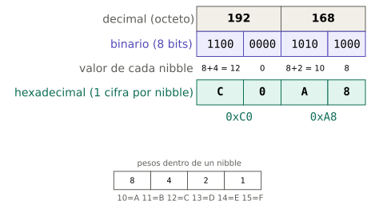
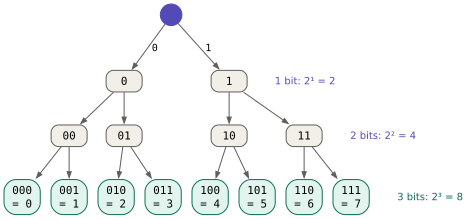
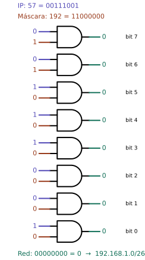
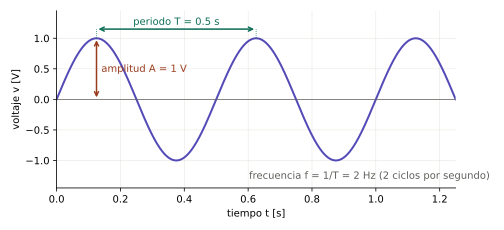
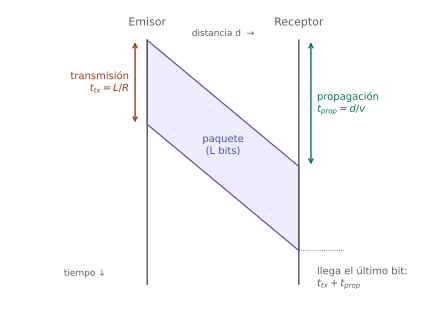

# Bloque 01 — Preliminares: números, bits y señales

> **Problema que abre el bloque:** una dirección como `192.168.1.57/26`, una MAC como `a4:5e:60:12:34:56`, un plan de "100 megas" que descarga a 12 MB por segundo, un Wi-Fi que marca −56 dBm y un `ping` que responde en 23 ms. Todo eso se lee con un puñado de herramientas matemáticas y físicas que el resto del curso usa en cada página: binario, hexadecimal, potencias de 2, operaciones lógicas, unidades, decibelios y tiempos.
>
> **Necesitas antes:** Bloque 00 (terminal). Álgebra de colegio: potencias y logaritmos. · **Referencias:** RFC 791 (protocolo IP, que define sus campos en octetos); RFC 1166 (notación decimal con puntos); IEC 80000-13 (prefijos binarios Ki, Mi, Gi).

## Cómo leer este bloque

Este bloque no habla todavía de redes, pero cada tema se elige porque un bloque posterior lo necesita. Al lado de cada idea se dice dónde se vuelve a usar. Quien ya domine un tema puede ir directo a sus ejercicios de la serie B: si salen bien y rápido, puede seguir de largo.

Para hacer cuentas se usa la terminal del Bloque 00. Dos calculadoras que están en cualquier Linux:

- **La aritmética de la *shell*:** `echo $(( expresión ))`. Solo trabaja con enteros.
- **Python como calculadora:** `python3 -c 'print(expresión)'`. Sirve para decimales, binario y logaritmos.

```console
$ echo $(( 2**10 ))
1024
$ python3 -c 'print(8 * 700 / 100)'
56.0
```

---

## Tema 1.1 — Sistemas de numeración: decimal, binario y hexadecimal

### 1. El problema

Un equipo de red solo sabe distinguir dos estados: hay voltaje o no hay, hay luz o no hay, la onda está en una fase o en otra. Todo lo que viaja —una dirección, una foto, un mensaje— tiene que escribirse con solo dos símbolos. Pero una dirección escrita así, `11000000101010000000000100111001`, es imposible de leer, dictar o copiar sin equivocarse. Hacen falta formas de escribir el mismo número que sirvan a la máquina y a la persona.

### 2. El mecanismo

**Sistema posicional.** En decimal, el número 305 significa $3 \cdot 100 + 0 \cdot 10 + 5 \cdot 1$. Cada posición vale diez veces la de su derecha: $10^0 = 1$, $10^1 = 10$, $10^2 = 100$. El 10 es la **base**, y hay tantos símbolos como indica la base (0 a 9).

Esa misma regla sirve con cualquier base:

| Sistema | Base | Símbolos | Peso de las posiciones (de derecha a izquierda) | Dónde aparece en redes |
|---|---|---|---|---|
| Decimal | 10 | 0–9 | 1, 10, 100, 1000… | Direcciones IPv4 (`192.168.1.57`), puertos |
| Binario | 2 | 0, 1 | 1, 2, 4, 8, 16, 32, 64, 128… | Lo que de verdad viaja; máscaras de red |
| Hexadecimal | 16 | 0–9, A–F | 1, 16, 256, 4096… | Direcciones MAC, IPv6, volcados de paquetes |

En hexadecimal hacen falta seis símbolos más que en decimal: A = 10, B = 11, C = 12, D = 13, E = 14, F = 15. Mayúsculas y minúsculas valen lo mismo (`c0` = `C0`).

**Por qué binario:** a un circuito le resulta fácil y confiable distinguir dos niveles (por ejemplo 0 V y 3.3 V) aunque haya ruido. Distinguir diez niveles sería mucho más frágil.

**Por qué hexadecimal:** porque $16 = 2^4$, **cada cifra hexadecimal equivale exactamente a 4 bits**. A un grupo de 4 bits se le llama ***nibble*** (medio byte). Pasar de binario a hexadecimal es cortar en grupos de 4 y reemplazar cada grupo por su cifra, sin hacer ninguna división:



**Conversiones, paso a paso:**

- **Binario → decimal:** sumar los pesos de las posiciones que tienen 1. $11000000_2 = 128 + 64 = 192$.
- **Decimal → binario (método de los pesos):** recorrer los pesos 128, 64, 32, 16, 8, 4, 2, 1; si el número alcanza para el peso, se escribe 1 y se resta; si no, se escribe 0. Es el método que se usa en subredes (Bloque 05).
- **Decimal → binario (divisiones sucesivas):** dividir entre 2, anotar el residuo, repetir con el cociente; los residuos leídos de abajo hacia arriba son el número binario.
- **Binario ↔ hexadecimal:** por *nibbles*, como en el esquema.
- **Hexadecimal → decimal:** pasar por binario, o multiplicar por potencias de 16: $\text{C0}_{16} = 12 \cdot 16 + 0 = 192$.

Para indicar la base se escribe un subíndice ($192_{10}$, $11000000_2$, $\text{C0}_{16}$) o, en programas y comandos, un prefijo: `0x` para hexadecimal (`0xC0`) y `0b` para binario (`0b11000000`).

*Analogía:* un número es una cantidad, y los sistemas de numeración son idiomas para escribirla. "Doce", "twelve" y "douze" son la misma cantidad; 12, 1100 y C también. **Dónde falla la analogía:** traducir entre idiomas pierde matices; entre bases no se pierde nada, la conversión es exacta y reversible.

### 3. En la vida real

La *shell* entiende otras bases si se le pone el prefijo `base#`, y `printf` escribe en hexadecimal:

```console
$ echo $(( 2#11000000 ))
192
$ echo $(( 0xC0 ))
192
$ printf '%x %X\n' 192 168
c0 A8
```

Python pasa a binario y rellena con ceros hasta 8 cifras:

```console
$ python3 -c 'print(bin(192), hex(192), format(5, "08b"))'
0b11000000 0xc0 00000101
```

Dónde se ven en un equipo real:

```console
$ ip link show wlp2s0
3: wlp2s0: <BROADCAST,MULTICAST,UP,LOWER_UP> mtu 1500 qdisc noqueue state UP mode DORMANT group default qlen 1000
    link/ether a4:5e:60:12:34:56 brd ff:ff:ff:ff:ff:ff
```

La dirección física (MAC, Bloque 04) `a4:5e:60:12:34:56` son 6 pares de cifras hexadecimales: 6 bytes, 48 bits. `ff:ff:ff:ff:ff:ff` son 48 unos (la dirección de "todos", Bloque 04).

### 4. Limitaciones

- La aritmética de la *shell* solo maneja enteros; `$(( 7 / 2 ))` da `3`. Para decimales, Python.
- `bin()` de Python no pone los ceros de la izquierda: `bin(5)` da `0b101`, no `0b00000101`. En redes un octeto **siempre** tiene 8 cifras binarias; se usa `format(n, "08b")`.
- Un número con ceros a la izquierda puede interpretarse en **octal** (base 8) en algunos programas: en Bash, `$(( 010 ))` da `8`, no `10` (Zsh, en cambio, da `10`). La función del sistema que traduce direcciones también lo hace: `192.168.1.010` se lee como `192.168.1.8`. No se escriben ceros a la izquierda en direcciones IPv4 (`192.168.001.010` es ambiguo y algunos programas lo rechazan o lo leen mal).

### 5. Fallas típicas y diagnóstico

| Síntoma | Causa probable | Cómo verificar | Corrección |
|---|---|---|---|
| Una conversión a binario "da" 7 cifras | Faltan los ceros de la izquierda. | Contar las cifras: un octeto tiene 8. | Rellenar a la izquierda con ceros. |
| Se leyó `0x10` como diez | Es hexadecimal: $1 \cdot 16 + 0 = 16$. | Mirar el prefijo. | Convertir antes de comparar. |
| La MAC anotada tiene una letra G, H… | No existe: el hexadecimal solo llega a F. Error de lectura o de copia. | Volver a leerla con `ip link`. | Copiar y pegar en vez de transcribir. |
| `ping 192.168.1.010` responde otro equipo | Algunas herramientas leen `010` como octal (= 8). | Probar sin el cero. | No usar ceros a la izquierda en IPv4. |

### 6. Dónde más aparece la idea

- **Direcciones IPv4** (Bloque 05): 32 bits escritos como cuatro números decimales, uno por octeto.
- **Direcciones MAC** (Bloque 04) e **IPv6** (Bloque 07): en hexadecimal, porque son largas (48 y 128 bits) y el hexadecimal las acorta cuatro veces.
- **Wireshark** (desde el Bloque 02) muestra cada paquete en hexadecimal, byte por byte.
- **Electrónica digital y microcontroladores:** los registros de un ESP32 o un Arduino se leen y escriben en hexadecimal por la misma razón.
- **Colores web:** `#534AB7` son tres bytes en hexadecimal (rojo 0x53, verde 0x4A, azul 0xB7).

### 7. Ejemplos resueltos

**Ejemplo 1. Decimal → binario por pesos.** Convertir 57.

| Peso | 128 | 64 | 32 | 16 | 8 | 4 | 2 | 1 |
|---|---|---|---|---|---|---|---|---|
| ¿Alcanza? | no | no | sí (57−32=25) | sí (25−16=9) | sí (9−8=1) | no | no | sí (1−1=0) |
| Bit | 0 | 0 | 1 | 1 | 1 | 0 | 0 | 1 |

$57_{10} = 00111001_2$. Verificación: $32+16+8+1 = 57$.

**Ejemplo 2. Decimal → binario por divisiones.** Convertir 168.

$168/2 = 84$ r 0; $84/2 = 42$ r 0; $42/2 = 21$ r 0; $21/2 = 10$ r 1; $10/2 = 5$ r 0; $5/2 = 2$ r 1; $2/2 = 1$ r 0; $1/2 = 0$ r 1. Leyendo los residuos de abajo hacia arriba: $10101000_2$.

**Ejemplo 3. Hexadecimal → binario → decimal.** El primer byte de una MAC es `a4`.

`a` = 10 = `1010`; `4` = `0100`. Entonces $\text{a4}_{16} = 10100100_2 = 128 + 32 + 4 = 164$.

### 8. Ejercicios

**Serie A — Conceptuales**

1. ¿Por qué el hexadecimal y no el decimal para abreviar el binario? ¿Qué propiedad de 16 lo hace cómodo?
2. ¿Por qué no se usan circuitos de diez niveles de voltaje para guardar cifras decimales directamente?
3. Si se escribe `10`, ¿qué cantidad representa en base 2, en base 10 y en base 16?

**Serie B — Cálculo**

4. Pasar a binario de 8 cifras: 255, 128, 10, 1, 0, 172, 224.
5. Pasar a decimal: `11111111`, `11100000`, `00001010`, `10000001`.
6. Pasar a hexadecimal: `11111111`, `00001010`, `11000000 10101000`.
7. Pasar a decimal: `0xFF`, `0x7F`, `0x1F`, `0xDB8`.
8. Una MAC empieza por `3c:52:82`. Escribir esos tres bytes en binario.

**Serie C — Laboratorio**

9. Verificar las respuestas de los ejercicios 4 a 7 con `$(( 2#… ))`, `$(( 0x… ))` y `printf '%x'`.
10. Ver la MAC de la propia interfaz con `ip link` y pasar su primer byte a binario.
11. Ver el texto "Hola" como bytes: `echo -n Hola | xxd`. Cada letra es un número (código ASCII): H = `48`, o = `6f`… Pasar `48` a decimal.
12. ⚠ **Romperlo a propósito:** en Bash (si la terminal usa otra *shell*, abrir una con `bash`), ejecutar `echo $(( 010 ))` y `echo $(( 08 ))`. Explicar el resultado del primero y leer el error del segundo (`valor demasiado grande para la base`). Luego ejecutar `getent ahostsv4 192.168.1.010` y ver a qué dirección la traduce el sistema.

<details>
<summary>Respuestas de la serie B</summary>

4. 255 = `11111111`; 128 = `10000000`; 10 = `00001010`; 1 = `00000001`; 0 = `00000000`; 172 = `10101100`; 224 = `11100000`.
5. 255, 224, 10, 129.
6. `FF`, `0A`, `C0A8`.
7. 255, 127, 31, $13 \cdot 256 + 11 \cdot 16 + 8 = 3512$.
8. `3c` = `00111100`; `52` = `01010010`; `82` = `10000010`.

</details>

---

## Tema 1.2 — Bit, byte y octeto

### 1. El problema

Hace falta una unidad para medir cuánta información hay en un mensaje y cuánta cabe en cada campo de un paquete. Y hace falta que dos fabricantes distintos entiendan lo mismo por esa unidad, porque un equipo que espera 8 posiciones donde otro puso 9 no entiende nada.

### 2. El mecanismo

- **Bit** (*binary digit*, dígito binario): la unidad mínima de información. Vale 0 o 1. Se abrevia con **b** minúscula.
- **Byte:** un grupo de bits que la máquina maneja como unidad. Hoy es de 8 bits en prácticamente todos los equipos. Se abrevia con **B** mayúscula.
- **Octeto** (*octet*): exactamente 8 bits, por definición.

**Por qué en redes se dice "octeto":** en los primeros computadores el byte no siempre tenía 8 bits (hubo de 6, 7 y 9). Las normas de internet necesitaban una palabra sin ambigüedad, y los RFC eligieron "octeto". Hoy byte y octeto coinciden en la práctica, pero los documentos de redes —y este curso, cuando habla de direcciones— dicen octeto.

Con 8 bits se escriben los números del 0 ($00000000_2$) al 255 ($11111111_2$): por eso cada número de una dirección IPv4 está entre 0 y 255.

**Bit más significativo y menos significativo.** En `11000000`, el bit de la izquierda vale 128 (el que más pesa, **MSB**, *most significant bit*) y el de la derecha vale 1 (**LSB**, *least significant bit*). Los bits de un octeto se numeran del 7 (izquierda) al 0 (derecha), igual que el exponente de su peso: el bit $k$ vale $2^k$.

**Todo es bytes.** Un carácter de texto se guarda como un número (código ASCII o UTF-8): la "H" es el byte `0x48` = 72. Una imagen, un audio, un paquete de red: todo termina siendo una fila de bytes. Qué significa cada byte lo decide el **formato** o el **protocolo**, no el byte.

### 3. En la vida real

```console
$ echo -n "Hola" | xxd
00000000: 486f 6c61                                Hola
```

`xxd` muestra a la izquierda la posición (en hexadecimal), en el medio los bytes (`48 6f 6c 61`, cuatro bytes, uno por letra) y a la derecha su lectura como texto. Wireshark muestra los paquetes exactamente así, en su panel inferior.

Los contadores de la interfaz cuentan bytes:

```console
$ ip -s link show wlp2s0
3: wlp2s0: <BROADCAST,MULTICAST,UP,LOWER_UP> mtu 1500 qdisc noqueue state UP mode DORMANT group default qlen 1000
    link/ether a4:5e:60:12:34:56 brd ff:ff:ff:ff:ff:ff
    RX:  bytes packets errors dropped  missed   mcast
      33767978   53508      0       0       0       0
    TX:  bytes packets errors dropped carrier collsns
      34962762   54503      0      25       0       0
```

`RX` (recibido) y `TX` (transmitido) cuentan bytes y paquetes desde que se encendió la interfaz. `mtu 1500` dice que cada paquete puede llevar como máximo 1500 bytes de datos (Bloque 04).

### 4. Limitaciones

- "Byte = 8 bits" es verdad en todo equipo actual, pero documentos y normas antiguas pueden usar otros tamaños; por eso las normas de red dicen "octeto".
- Un carácter no siempre es un byte: en UTF-8 la "ñ" y las tildes ocupan 2 bytes, y un emoji 4. Contar letras no es contar bytes.
- Los contadores de `ip -s link` se reinician al apagar la interfaz o el equipo.

### 5. Fallas típicas y diagnóstico

| Síntoma | Causa probable | Cómo verificar | Corrección |
|---|---|---|---|
| Un cálculo de velocidad sale 8 veces más grande o más pequeño | Se mezclaron bits (b) y bytes (B). | Revisar las unidades en cada paso. | Pasar todo a bits (×8) o a bytes (÷8) antes de operar. |
| Un nombre con tilde "no cabe" en un campo de 16 caracteres | Cada tilde ocupa 2 bytes en UTF-8. | `echo -n "Tunja-Galpón" \| wc -c` cuenta bytes. | Contar bytes, no letras; o evitar tildes en nombres de red (SSID, *hostname*). |
| Un número de una IPv4 escrito como 256 o 300 | Un octeto no pasa de 255. | Pasar a binario: no cabe en 8 bits. | Revisar la dirección. |

### 6. Dónde más aparece la idea

- **Cabeceras de protocolos:** cada campo mide un número exacto de bits (el TTL, 8 bits; un puerto, 16 bits; una dirección IPv4, 32 bits). Los diagramas de los RFC dibujan las cabeceras en filas de 32 bits (Bloques 05 a 08).
- **Tamaño de paquetes y MTU** (Bloque 04), en bytes.
- **Registros de un microcontrolador:** cada bit de un registro de 8 bits enciende o apaga una función (un pin, una interrupción).

### 7. Ejemplos resueltos

**Ejemplo 1.** ¿Cuántos bits tiene una dirección IPv4? Cuatro octetos: $4 \times 8 = 32$ bits. ¿Y una MAC? Seis bytes: $6 \times 8 = 48$ bits.

**Ejemplo 2.** En `10110010`, ¿cuánto vale el bit 5? Numerando de derecha a izquierda desde 0: bit 0 = 0, bit 1 = 1, bit 2 = 0, bit 3 = 0, bit 4 = 1, bit 5 = 1. Vale 1, y su peso es $2^5 = 32$.

### 8. Ejercicios

**Serie A — Conceptuales**

1. ¿Por qué las normas de internet prefieren "octeto" a "byte"?
2. ¿Qué decide lo que "significa" un byte: el byte mismo o el protocolo? Dar un ejemplo.

**Serie B — Cálculo**

3. ¿Cuántos bits tiene una dirección IPv6 de 16 bytes? ¿Cuántas cifras hexadecimales?
4. Un paquete de 1500 bytes, ¿cuántos bits son?
5. En `ip -s link`, RX pasó de 33 767 978 a 34 017 978 bytes en 10 segundos. ¿Cuántos bytes por segundo se recibieron? ¿Cuántos bits por segundo?

**Serie C — Laboratorio**

6. Comparar `echo -n "galpon" | wc -c` con `echo -n "galpón" | wc -c` y explicar la diferencia.
7. Ver los bytes de "ñ" con `echo -n ñ | xxd`.
8. Leer los contadores RX de la interfaz principal, descargar algo grande (una actualización, un video) y volver a leerlos. Calcular cuántos megabytes entraron.

<details>
<summary>Respuestas de la serie B</summary>

3. $16 \times 8 = 128$ bits; 32 cifras hexadecimales (una por cada 4 bits).
4. $1500 \times 8 = 12\,000$ bits.
5. $250\,000 / 10 = 25\,000$ B/s; $\times 8 = 200\,000$ bit/s = 200 kbit/s.

</details>

---

## Tema 1.3 — Potencias de 2: cuántas combinaciones caben en *n* bits

### 1. El problema

Al diseñar una red hay que responder preguntas de cantidad: ¿cuántos equipos caben en esta subred?, ¿cuántos puertos puede tener un equipo?, ¿se pueden acabar las direcciones? Todas se responden sabiendo cuántos valores distintos se escriben con un número dado de bits.

### 2. El mecanismo

Con 1 bit hay 2 valores (0 y 1). Cada bit que se añade **duplica** las combinaciones, porque cada combinación anterior puede seguir con un 0 o con un 1:



$$\text{combinaciones con } n \text{ bits} = 2^n \qquad \text{valores de } 0 \text{ a } 2^n - 1$$

La inversa responde "¿cuántos bits hacen falta para $N$ valores?": el menor $n$ tal que $2^n \ge N$. Por ejemplo, para 50 valores: $2^5 = 32$ no alcanza, $2^6 = 64$ sí; hacen falta 6 bits. Con logaritmos: $n = \lceil \log_2 N \rceil$ (el techo, redondeado hacia arriba).

**Tabla que conviene saberse de memoria** (reaparece en el Anexo D):

| $n$ | $2^n$ | Dónde aparece |
|---|---|---|
| 0 | 1 | |
| 1 | 2 | |
| 2 | 4 | subred /30: enlace entre dos routers (Bloque 05) |
| 3 | 8 | |
| 4 | 16 | valores de una cifra hexadecimal |
| 5 | 32 | |
| 6 | 64 | subred /26 |
| 7 | 128 | |
| 8 | 256 | valores de un octeto; subred /24 |
| 10 | 1024 | el "kibi" (Ki) |
| 12 | 4096 | identificadores de VLAN (Bloque 04) |
| 16 | 65 536 | puertos TCP y UDP (Bloque 08) |
| 20 | 1 048 576 | el "mebi" (Mi) |
| 24 | 16 777 216 | la red privada 10.0.0.0/8 tiene $2^{24}$ direcciones |
| 32 | 4 294 967 296 | todas las direcciones IPv4 |
| 48 | ≈ $2.8 \times 10^{14}$ | todas las direcciones MAC |
| 128 | ≈ $3.4 \times 10^{38}$ | todas las direcciones IPv6 |

Regla práctica para estimar: $2^{10} = 1024 \approx 10^3$. Así, $2^{32} = 2^2 \cdot (2^{10})^3 \approx 4 \times 10^9$: unos cuatro mil millones de direcciones IPv4, menos que personas en el planeta. Esa es la razón de fondo de NAT (Bloque 06) e IPv6 (Bloque 07).

### 3. En la vida real

```console
$ echo $(( 2**16 ))
65536
$ echo $(( 2**32 ))
4294967296
$ python3 -c 'import math; print(math.ceil(math.log2(50)))'
6
```

Adelanto del Bloque 05: en la dirección `192.168.1.57/26`, el `/26` dice que 26 de los 32 bits identifican la red, así que quedan $32 - 26 = 6$ bits para los equipos: $2^6 = 64$ direcciones.

### 4. Limitaciones

- $2^n$ cuenta **combinaciones**, no necesariamente valores **utilizables**. En una subred IPv4 se reservan dos (la de la red y la de difusión): de las 64 de un /26 se usan 62 (Bloque 05). En puertos, el 0 no se usa.
- La aproximación $2^{10} \approx 1000$ tiene un error del 2.4 %, que se acumula: $2^{30} \approx 10^9$ ya se desvía un 7 %. Sirve para estimar, no para diseñar.
- La aritmética de la *shell* trabaja con enteros de 64 bits: `$(( 2**64 ))` da `0` (se desborda). Para números grandes, Python.

### 5. Fallas típicas y diagnóstico

| Síntoma | Causa probable | Cómo verificar | Corrección |
|---|---|---|---|
| Faltan direcciones en una subred "de 64" | Se olvidó restar las dos reservadas. | Contar las usables: $2^n - 2$. | Elegir un bit más para equipos. |
| Se calculan "8 bits = 16 combinaciones" | Se multiplicó $2 \times 8$ en vez de elevar $2^8$. | Recordar que cada bit **duplica**. | $2^8 = 256$. |
| `$(( 2**64 ))` da 0 | Desbordamiento de enteros de 64 bits. | Probar en Python. | Usar Python para números grandes. |

### 6. Dónde más aparece la idea

- **Direccionamiento y subredes** (Bloques 05 y 07): todo el cálculo de subredes es jugar con $2^n$.
- **Puertos** (Bloque 08): 16 bits → 65 536 puertos.
- **Resolución de un conversor analógico-digital:** un ADC de 12 bits (como el del ESP32) distingue $2^{12} = 4096$ niveles de voltaje. La misma cuenta.
- **Contraseñas:** una clave de 8 caracteres elegidos entre 64 símbolos tiene $64^8 = 2^{48}$ combinaciones: la seguridad también se mide en bits (Bloque 13).

### 7. Ejemplos resueltos

**Ejemplo 1.** Una granja necesita una subred con 25 cámaras. ¿Cuántos bits para equipos?

Hacen falta 25 direcciones usables más 2 reservadas: 27. $2^4 = 16$ no alcanza; $2^5 = 32$ sí. Se necesitan 5 bits: una subred /27 ($32 - 5 = 27$). Sobran $32 - 27 = 5$ direcciones para crecer.

**Ejemplo 2.** ¿Cuántas VLAN se pueden numerar con 12 bits? $2^{12} = 4096$ valores (de 0 a 4095). La norma reserva la 0 y la 4095, así que se usan 4094 (Bloque 04).

### 8. Ejercicios

**Serie A — Conceptuales**

1. Explicar con el árbol de combinaciones por qué añadir un bit duplica la cantidad y no suma 2.
2. ¿Por qué el agotamiento de IPv4 era inevitable, mirando solo $2^{32}$?

**Serie B — Cálculo**

3. ¿Cuántos bits hacen falta para numerar 200 equipos? ¿Y 1000? ¿Y 5?
4. Calcular sin calculadora: $2^9$, $2^{11}$, $2^{15}$.
5. Estimar $2^{40}$ con la regla $2^{10} \approx 10^3$ y compararlo con el valor exacto en Python.
6. Si una subred tiene 4 bits de equipos, ¿cuántas direcciones tiene? ¿Cuántas usables?

**Serie C — Laboratorio**

7. Verificar la tabla de potencias con un lazo: `for n in 1 2 4 8 16 32; do echo "$n: $(( 2**n ))"; done`.
8. ⚠ **Romperlo a propósito:** ejecutar `echo $(( 2**63 ))` y `echo $(( 2**64 ))`. Explicar por qué el primero sale negativo y el segundo sale 0. Repetir en Python.

<details>
<summary>Respuestas de la serie B</summary>

3. 200 → 8 bits ($2^8 = 256$); 1000 → 10 bits ($2^{10} = 1024$); 5 → 3 bits ($2^3 = 8$).
4. 512, 2048, 32 768.
5. $2^{40} = (2^{10})^4 \approx 10^{12}$. Exacto: 1 099 511 627 776, un 10 % más.
6. $2^4 = 16$ direcciones; 14 usables.

</details>

---

## Tema 1.4 — Operaciones lógicas bit a bit

### 1. El problema

Un equipo recibe un paquete para la dirección `192.168.1.57` y tiene que decidir, en millonésimas de segundo, si ese destino está en su misma red o si debe enviarlo a otro lado. No puede "leer" la dirección como una persona: necesita una operación simple, que un circuito haga de un golpe, para quedarse con la parte de la dirección que identifica a la red. Esa operación existe, y es una de cuatro operaciones lógicas.

### 2. El mecanismo

Las **operaciones lógicas** trabajan con valores de verdad: 1 (verdadero) y 0 (falso). Hay cuatro básicas:

| A | B | NOT A | A AND B | A OR B | A XOR B |
|---|---|---|---|---|---|
| 0 | 0 | 1 | 0 | 0 | 0 |
| 0 | 1 | 1 | 0 | 1 | 1 |
| 1 | 0 | 0 | 0 | 1 | 1 |
| 1 | 1 | 0 | 1 | 1 | 0 |

- **NOT** (negación): invierte.
- **AND** (y): da 1 solo si **ambos** son 1.
- **OR** (o): da 1 si **al menos uno** es 1.
- **XOR** (o exclusivo, *exclusive or*): da 1 si son **distintos**.

**Bit a bit** (*bitwise*): cuando se aplican a dos octetos, se opera cada columna por separado, sin acarreos:

```
    00111001   (57)
AND 11000000   (192)
    --------
    00000000   (0)
```

**La propiedad que hace útil al AND:** mirando la tabla, `x AND 1 = x` y `x AND 0 = 0`. Es decir, un 1 **deja pasar** el bit y un 0 lo **borra**. Un número hecho de unos seguidos de ceros funciona como una plantilla que conserva la parte izquierda y borra la derecha. Esa plantilla es la **máscara de red** (Bloque 05):



Del mismo modo: `x OR 1 = 1` (el OR **enciende** bits), `x XOR 1 = NOT x` (el XOR **invierte** los bits elegidos) y `x XOR x = 0` (el XOR **detecta diferencias**).

*Analogía:* el AND con una máscara es como una plantilla de cartón con huecos puesta sobre una hoja: solo se ve lo que queda bajo los huecos. **Dónde falla:** en la plantilla lo tapado sigue estando debajo; en el AND los bits borrados quedan en 0 y el resultado ya no los tiene.

### 3. En la vida real

La *shell* tiene los cuatro operadores: `&` (AND), `|` (OR), `^` (XOR) y `~` (NOT).

```console
$ echo $(( 57 & 192 ))
0
$ echo $(( 57 | 192 ))
249
$ echo $(( 57 ^ 255 ))
198
```

Las **banderas** (*flags*) que muestra `ip link` entre `< >` (`BROADCAST,MULTICAST,UP,LOWER_UP`) son bits de un mismo número: el sistema guarda un bit por propiedad, las enciende con OR y pregunta por una con AND. Lo mismo hacen las banderas de TCP (SYN, ACK…) en el Bloque 08.

### 4. Limitaciones

- En la *shell*, `~` invierte los **64** bits del número, no 8: `$(( ~255 ))` da `-256`. Para quedarse con un octeto hay que recortar con AND: `$(( ~255 & 0xFF ))` da `0`.
- Cuidado con los símbolos: en la *shell*, `|` fuera de `$(( ))` es una tubería (Bloque 00), no un OR; y `^` en otros lenguajes (o en matemáticas) significa potencia, pero en `$(( ))` y en Python es XOR. La potencia es `**`.
- Las operaciones lógicas no tienen acarreo: `1 OR 1 = 1`, mientras que $1 + 1 = 10_2$ en la suma binaria.

### 5. Fallas típicas y diagnóstico

| Síntoma | Causa probable | Cómo verificar | Corrección |
|---|---|---|---|
| `$(( 2^8 ))` da 10 | `^` es XOR: $00000010 \oplus 00001000 = 00001010$. | — | Potencia: `$(( 2**8 ))`. |
| `$(( ~0 ))` da -1 en vez de 255 | NOT sobre 64 bits. | — | `$(( ~0 & 0xFF ))`. |
| Resultado de un AND a mano que no coincide | Se sumó con acarreo en vez de operar columna por columna. | Rehacer columna a columna. | Recordar: bit a bit, sin acarreo. |

### 6. Dónde más aparece la idea

- **Máscara de red** (Bloque 05): AND entre dirección y máscara da la dirección de red. Es la operación que decide "¿local o puerta de enlace?" (Bloque 06).
- **Máscara comodín** (*wildcard*) en routers: es el NOT de la máscara. `0.0.0.255` = NOT `255.255.255.0`.
- **Dirección de difusión** (Bloque 05): OR entre la dirección de red y el NOT de la máscara.
- **Bit de paridad:** el XOR de todos los bits de un dato; si un bit cambia en el camino, la paridad no coincide. Es la forma más simple de detección de errores (el FCS de Ethernet, Bloque 04, es una versión mucho más potente de la misma idea).
- **Electrónica digital:** las compuertas lógicas 7408 (AND), 7432 (OR), 7486 (XOR) y 7404 (NOT) hacen exactamente estas operaciones con voltajes.
- **Control:** las condiciones de un PLC ("arrancar el motor si hay presión **y** no hay alarma") son AND, OR y NOT.

### 7. Ejemplos resueltos

**Ejemplo 1. ¿Está en mi red?** Un equipo con máscara `255.255.255.0` y dirección `192.168.1.20` quiere enviar a `192.168.1.57` y a `192.168.2.57`.

- `192.168.1.57 AND 255.255.255.0` = `192.168.1.0`. Su propia red: `192.168.1.20 AND 255.255.255.0` = `192.168.1.0`. **Iguales:** entrega directa.
- `192.168.2.57 AND 255.255.255.0` = `192.168.2.0`. **Distinta:** hay que pasar por la puerta de enlace.

(Con 255 el AND deja el octeto intacto, y con 0 lo borra: por eso con esta máscara basta mirar los tres primeros octetos. Con máscaras como `255.255.255.192` hay que ir al binario; eso es el Bloque 05.)

**Ejemplo 2. Máscara comodín.** NOT `255.255.255.192`: el último octeto es `11000000`, su NOT es `00111111` = 63; los demás octetos son 255 → 0. Resultado: `0.0.0.63`.

### 8. Ejercicios

**Serie A — Conceptuales**

1. ¿Por qué el AND con un 1 "deja pasar" y con un 0 "borra"? Explicarlo con la tabla.
2. ¿Qué operación usaría para saber si dos octetos son idénticos, y qué resultado indicaría que lo son?

**Serie B — Cálculo** (a mano, en binario, y luego pasar a decimal)

3. `172 AND 240`, `172 OR 15`, `172 XOR 255`.
4. `57 AND 224`, `57 AND 192`, `57 AND 128`.
5. NOT de `255.255.255.224` (máscara comodín).
6. La paridad (XOR de todos los bits) de `10110010`. Si en el camino se invierte el bit 0, ¿cuál es la nueva paridad?

**Serie C — Laboratorio**

7. Verificar los ejercicios 3 y 4 con `$(( ))`.
8. Escribir un comando que, dado un número entre 0 y 255, muestre su NOT de 8 bits.
9. ⚠ **Romperlo a propósito:** ejecutar `echo $(( 2^10 ))` esperando 1024. Explicar el resultado en binario.

<details>
<summary>Respuestas de la serie B</summary>

3. $172 = 10101100$, $240 = 11110000$: AND = $10100000$ = 160. $172$ OR $00001111$ = $10101111$ = 175. $172$ XOR $11111111$ = $01010011$ = 83.
4. $57 = 00111001$. AND 224 ($11100000$) = $00100000$ = 32. AND 192 = 0. AND 128 = 0.
5. `0.0.0.31`.
6. Hay cuatro unos: paridad 0. Al invertir el bit 0 quedan cinco unos: paridad 1. El cambio se detecta.

</details>

---

## Tema 1.5 — Unidades de velocidad y tamaño

### 1. El problema

Se contrata un plan de "100 megas", se descarga un archivo y el navegador muestra "11.8 MB/s". Un disco "de 1 TB" aparece en el sistema con 931 G. Parece que todos engañan, pero no: cada número usa una unidad distinta. Un técnico que no distinga esas unidades no puede decir si una red rinde lo que debe.

### 2. El mecanismo

**Dos trampas que se combinan:**

**Trampa 1 — bits frente a bytes.** Las **velocidades de red** se miden en **bits por segundo** (b/s, bit/s o bps): así lo hacen los proveedores, las normas Ethernet y Wi-Fi y las tarjetas de red. Los **tamaños de archivo** y las descargas del navegador se miden en **bytes** (B). La diferencia es un factor 8.

$$\text{velocidad en B/s} = \frac{\text{velocidad en bit/s}}{8}$$

**Trampa 2 — prefijos decimales frente a binarios.** "Kilo" significa 1000 en el Sistema Internacional. Pero en informática se usó durante décadas "kilo" para 1024 ($2^{10}$), porque es la potencia de 2 más cercana. Para acabar con la confusión, la norma IEC 80000-13 creó prefijos binarios propios:

| Decimal (SI) | Valor | Binario (IEC) | Valor | Diferencia |
|---|---|---|---|---|
| k (kilo) | $10^3$ | Ki (kibi) | $2^{10} = 1024$ | 2.4 % |
| M (mega) | $10^6$ | Mi (mebi) | $2^{20}$ | 4.9 % |
| G (giga) | $10^9$ | Gi (gibi) | $2^{30}$ | 7.4 % |
| T (tera) | $10^{12}$ | Ti (tebi) | $2^{40}$ | 10 % |

**Quién usa qué:**

| Contexto | Prefijo |
|---|---|
| Velocidades de red (Ethernet, Wi-Fi, planes de internet) | **siempre decimal**: 1 Gbit/s = $10^9$ bit/s |
| Fabricantes de discos y memorias USB | decimal |
| Memoria RAM | binario (aunque diga "GB") |
| Linux: `ls -lh`, `df -h`, `free -h` | binario, pero escrito como K, M, G sin la "i" |
| Linux: `df -H` | decimal |

La **k** de kilo va en minúscula; la **K** mayúscula sola es una costumbre informática para 1024. **b** es bit y **B** es byte.

### 3. En la vida real

El mismo disco, medido de las dos formas:

```console
$ df -h /
S.ficheros     Tamaño Usados  Disp Uso% Montado en
/dev/sda1        144G    92G   44G  68% /
$ df -H /
S.ficheros     Tamaño Usados  Disp Uso% Montado en
/dev/sda1        154G    99G   48G  68% /
```

144 GiB (`-h`) y 154 GB (`-H`) son el mismo espacio. `numfmt` convierte entre ambas:

```console
$ numfmt --to=iec 1000000000
954M
$ numfmt --to=si 1073741824
1.1G
```

Mil millones de bytes son 954 MiB; un GiB son 1.1 GB.

La velocidad de un enlace Wi-Fi, en bits:

```console
$ iw dev wlp2s0 link
Connected to a4:5e:60:ab:cd:ef (on wlp2s0)
	SSID: granja-oficina
	freq: 2427.0
	signal: -56 dBm
	rx bitrate: 54.0 MBit/s
```

54 Mbit/s de velocidad de enlace son, como mucho, $54/8 = 6.75$ MB/s, y en la práctica bastante menos (Bloque 11).

### 4. Limitaciones

- La velocidad contratada o la del enlace es un **máximo**. Lo que de verdad llega (el **rendimiento**, *throughput*, Bloque 03) es menor: cada paquete lleva cabeceras que no son datos útiles, hay retransmisiones, y el enlace se comparte. Con Ethernet, una descarga ve entre el 94 % y el 97 % de la velocidad nominal; con Wi-Fi, a menudo la mitad o menos.
- Muchos programas no dicen qué prefijo usan. Ante la duda, se comprueba con un tamaño conocido.

### 5. Fallas típicas y diagnóstico

| Síntoma | Causa probable | Cómo verificar | Corrección |
|---|---|---|---|
| "Pago 100 megas y descargo a 12" | 100 Mbit/s = 12.5 MB/s. No es falla. | Pasar a la misma unidad. | Comparar bit/s con bit/s. |
| El disco nuevo "tiene menos" de lo que dice la caja | La caja usa GB decimales; el sistema, GiB. | `df -H` frente a `df -h`. | No es falla. |
| La descarga va a 1.2 MB/s en un plan de 100 Mbit/s | Esta vez sí hay un problema: se esperaban unos 11–12 MB/s. | Probar por cable, cerca del router (Bloques 03, 11, 15). | Diagnosticar por capas. |

### 6. Dónde más aparece la idea

- **Rendimiento y capacidad** (Bloques 03 y 15): toda medición de `iperf3` se da en bit/s.
- **MTU y tamaños de paquete** (Bloque 04), en bytes.
- **Instrumentación:** un osciloscopio o una tarjeta de adquisición mide en muestras por segundo; un ADC de 12 bits a 1 MS/s produce 12 Mbit/s. La misma cuenta de bits y segundos.

### 7. Ejemplos resueltos

**Ejemplo 1. ¿Cuánto tarda en bajar un archivo?** Un archivo de 700 MB por un plan de 100 Mbit/s.

$700 \text{ MB} \times 8 = 5600 \text{ Mbit}$. $5600 / 100 = 56$ s en el mejor caso. Con un rendimiento real del 90 %: unos 62 s.

**Ejemplo 2. Cámaras.** Diez cámaras que envían cada una 4 Mbit/s de video a un grabador. ¿Alcanza un enlace de 100 Mbit/s? $10 \times 4 = 40$ Mbit/s: sí, con margen. ¿Y cuánto disco ocupan en 24 horas? $40 \text{ Mbit/s} / 8 = 5$ MB/s; $5 \times 86\,400$ s $= 432\,000$ MB = 432 GB por día.

### 8. Ejercicios

**Serie A — Conceptuales**

1. ¿Por qué los proveedores anuncian en bits y los navegadores muestran en bytes?
2. ¿Qué pasa con la diferencia entre prefijos decimales y binarios a medida que crecen (k, M, G, T)?

**Serie B — Cálculo**

3. Pasar a MB/s: 10 Mbit/s, 300 Mbit/s, 1 Gbit/s.
4. ¿Cuánto tarda en subir un respaldo de 20 GB por un enlace de subida de 10 Mbit/s?
5. ¿Cuántos GiB son 500 GB?
6. Un sensor ESP32 envía un mensaje de 200 bytes cada 10 s. ¿Cuántos bit/s promedio genera? ¿Y cien sensores?

**Serie C — Laboratorio**

7. Comparar `df -h` y `df -H` en el propio equipo y calcular la razón entre ambos tamaños.
8. Si hay Wi-Fi, ver `iw dev <interfaz> link` y pasar el `rx bitrate` a MB/s.
9. Descargar un archivo grande conocido y comparar la velocidad que muestra el navegador (MB/s) con el plan contratado (Mbit/s).

<details>
<summary>Respuestas de la serie B</summary>

3. 1.25 MB/s, 37.5 MB/s, 125 MB/s.
4. $20 \times 8 = 160$ Gbit $= 160\,000$ Mbit; $/10 = 16\,000$ s ≈ 4.4 horas.
5. $500 \times 10^9 / 2^{30} \approx 465.7$ GiB.
6. $200 \times 8 / 10 = 160$ bit/s. Cien sensores: 16 kbit/s. Los sensores casi no ocupan capacidad; su problema es otro (alcance y consumo, Bloque 11).

</details>

---

## Tema 1.6 — Física de señales, lo mínimo

### 1. El problema

Los bits no viajan como unos y ceros: viajan como voltajes en un cable, pulsos de luz en una fibra u ondas de radio en el aire. Y en el camino se debilitan y se mezclan con ruido. Para entender por qué un cable tiene 100 m de límite, por qué el Wi-Fi no atraviesa un galpón metálico o qué significa "señal −75 dBm", hace falta un vocabulario mínimo de señales.

### 2. El mecanismo

**Voltaje:** la "presión" eléctrica entre dos puntos, en voltios (V). En un cable de red, los bits se representan con cambios de voltaje (Bloque 03).

**Señal periódica.** Muchas señales se repiten: la más sencilla es la senoidal.



| Magnitud | Símbolo | Qué es | Unidad |
|---|---|---|---|
| Amplitud | $A$ | Altura máxima de la onda | V (o la unidad de la señal) |
| Periodo | $T$ | Tiempo que tarda un ciclo completo | s |
| Frecuencia | $f$ | Ciclos por segundo: $f = 1/T$ | hercio (Hz) |
| Velocidad de propagación | $v$ | Qué tan rápido avanza la onda por el medio | m/s |
| Longitud de onda | $\lambda$ | Distancia que recorre la onda en un periodo: $\lambda = v/f$ | m |

**Velocidad de propagación.** En el vacío, las ondas electromagnéticas (luz y radio) viajan a $c \approx 3 \times 10^8$ m/s. En el aire, prácticamente igual. En un cable de cobre o en una fibra óptica van más despacio, alrededor de $2 \times 10^8$ m/s (unos dos tercios de $c$).

**Atenuación:** la pérdida de potencia de la señal con la distancia. En un cable, parte de la energía se convierte en calor; en el aire, la energía se reparte en un área cada vez mayor y además la absorben paredes, árboles y agua.

**Ruido:** toda señal que no es la que interesa y se suma a ella: motores, fluorescentes, otras redes, el propio calor del circuito. Lo que importa no es cuánto ruido hay, sino **cuánta señal hay por encima del ruido**: la relación señal-ruido (SNR, *signal-to-noise ratio*).

**El decibelio (dB).** Las potencias en redes varían en rangos enormes: un punto de acceso Wi-Fi emite unos 0.1 W, y al celular del otro lado de la casa llegan quizá 0.000 000 01 W. Escribir esos números es incómodo, y los cálculos serían multiplicaciones y divisiones. El decibelio los convierte en sumas y restas usando logaritmos:

$$\text{ganancia o pérdida en dB} = 10 \log_{10} \frac{P_2}{P_1}$$

Equivalencias que conviene saberse:

| dB | Factor de potencia |
|---|---|
| +3 dB | ×2 (el doble) |
| +10 dB | ×10 |
| +20 dB | ×100 |
| −3 dB | ×½ (la mitad) |
| −10 dB | ×1/10 |
| −30 dB | ×1/1000 |

**El dBm** es una potencia absoluta: decibelios respecto a 1 milivatio.

$$P_{\text{dBm}} = 10 \log_{10} \frac{P}{1 \text{ mW}}$$

0 dBm = 1 mW; 20 dBm = 100 mW; −30 dBm = 1 µW; −70 dBm = 0.1 nW. La regla que lo hace útil: **dBm ± dB = dBm**. Un transmisor de 20 dBm, con un cable que pierde 3 dB y un camino que pierde 70 dB, entrega $20 - 3 - 70 = -53$ dBm.

La SNR se calcula como una resta: señal −56 dBm, ruido −90 dBm → SNR = 34 dB.

(Con voltajes en lugar de potencias se usa $20 \log_{10}(V_2/V_1)$, porque la potencia va con el cuadrado del voltaje. En este curso casi siempre se habla de potencias.)

*Analogía:* el dB es como decir "tres pisos más abajo" en vez de dar la altura de cada piso en centímetros: se cuentan escalones iguales. **Dónde falla:** cada "escalón" de 10 dB no suma una cantidad fija, **multiplica** por 10. Bajar de −50 a −60 dBm es perder el 90 % de la potencia que quedaba.

### 3. En la vida real

En la salida de `iw` de arriba: `freq: 2427.0` (MHz, canal 4 de Wi-Fi) y `signal: -56 dBm`. Su longitud de onda:

```console
$ python3 -c 'print(3e8 / 2427e6)'
0.12360939431396786
```

Unos 12 cm: del tamaño de las antenas de un router. La potencia recibida:

```console
$ python3 -c 'print(10**(-56/10), "mW")'
2.5118864315095823e-06 mW
```

Unos 2.5 nanovatios: la señal que llega es millones de veces más débil que la emitida, y aun así sirve. Referencias prácticas para Wi-Fi:

| Señal recibida | Calidad |
|---|---|
| −30 a −50 dBm | Excelente (muy cerca del punto de acceso) |
| −50 a −65 dBm | Buena |
| −65 a −75 dBm | Aceptable; la velocidad baja |
| por debajo de −80 dBm | Mala; conexión inestable |

### 4. Limitaciones

- Una red real no transmite senoidales puras: transmite señales complejas que se pueden descomponer en muchas senoidales (análisis de Fourier). El vocabulario de este tema sigue sirviendo, pero la forma exacta se estudia en el Bloque 03 y en cursos de comunicaciones.
- Los valores de dBm de Wi-Fi que muestra cada equipo dependen de su antena y su electrónica: sirven para comparar en el mismo equipo, no para comparar equipos distintos al decibelio.
- El dB solo tiene sentido como **razón** entre dos potencias; "20 dB" a secas no dice cuánta potencia hay. El dBm sí.

### 5. Fallas típicas y diagnóstico

| Síntoma | Causa probable | Cómo verificar | Corrección |
|---|---|---|---|
| Se leyó −80 dBm como "mejor" que −60 dBm | Números negativos: −80 es **menor**, 100 veces menos potencia. | Pasar a mW. | Recordar: más cerca de 0 = más fuerte. |
| Se sumaron dos potencias en dBm (−60 + −60) | Los dBm no se suman entre sí; se suman dBm con dB. | Pasar a mW, sumar, volver a dBm (dos señales iguales suman +3 dB: −57 dBm). | Sumar en mW. |
| Wi-Fi que "tiene señal" pero va lento | Buena señal pero SNR baja (mucho ruido o interferencia de otras redes). | `iw` para la señal; analizador Wi-Fi para ver redes vecinas (Bloque 11). | Cambiar de canal o de banda. |

### 6. Dónde más aparece la idea

- **Capa física** (Bloque 03): atenuación y ruido explican el límite de 100 m del cable de cobre y por qué se trenzan los pares.
- **Redes inalámbricas** (Bloque 11): presupuesto de enlace en dB, bandas de frecuencia, longitud de onda y tamaño de antenas, zona de Fresnel.
- **Fibra óptica** (Bloque 03): la atenuación se da en dB/km.
- **Audio y control:** los diagramas de Bode de un curso de control usan dB por la misma razón: convertir productos de ganancias en sumas.
- **La vida cotidiana:** el volumen del sonido también se mide en dB porque el oído percibe de forma logarítmica.

### 7. Ejemplos resueltos

**Ejemplo 1. Presupuesto de enlace.** Un punto de acceso emite 20 dBm. Llegan −62 dBm a un celular. ¿Cuánto se perdió? $20 - (-62) = 82$ dB. En potencia: $10^{8.2} \approx 1.6 \times 10^8$ veces menos.

**Ejemplo 2. Pérdida en espacio libre.** Sin obstáculos, la potencia de una onda de radio cae con el cuadrado de la distancia: al **doblar** la distancia se pierden **6 dB** (un factor 4). Si a 10 m llegan −40 dBm, a 20 m llegan −46 dBm, a 40 m −52 dBm y a 80 m −58 dBm. Paredes, árboles y techos metálicos se restan aparte: una pared de ladrillo puede quitar 5 a 10 dB; una lámina metálica, bastante más (Bloque 11).

**Ejemplo 3. Longitud de onda en 5 GHz.** $\lambda = 3 \times 10^8 / 5 \times 10^9 = 0.06$ m = 6 cm. La mitad que en 2.4 GHz: antenas más pequeñas y, como se verá, menos capacidad para atravesar obstáculos.

### 8. Ejercicios

**Serie A — Conceptuales**

1. ¿Por qué se usa el decibelio en lugar de vatios para hablar de señales de radio?
2. Una red tiene señal de −60 dBm y otra de −70 dBm. ¿Cuántas veces más potente es la primera?
3. ¿Qué importa más para que una transmisión funcione: la potencia de la señal o la relación señal-ruido? Explicar.

**Serie B — Cálculo**

4. Pasar a dBm: 1 W, 100 mW, 1 mW, 0.001 mW.
5. Pasar a mW: 30 dBm, 13 dBm, −20 dBm.
6. Calcular la longitud de onda de 2.4 GHz y de 6 GHz.
7. ¿Cuánto tarda la luz en recorrer 100 m de fibra ($v = 2 \times 10^8$ m/s)?
8. Un transmisor de 23 dBm, un cable que pierde 2 dB, una antena que gana 5 dB y un trayecto que pierde 95 dB. ¿Qué potencia llega?

**Serie C — Laboratorio**

9. Con Wi-Fi: ejecutar `iw dev <interfaz> link` cerca del punto de acceso, a 10 m y detrás de dos paredes. Anotar la señal en cada punto y calcular cuántos dB se perdieron.
10. Escribir una línea de Python que convierta dBm a mW y probarla con los valores del ejercicio 5.
11. ⚠ **Romperlo a propósito:** "sumar" −60 dBm + −60 dBm directamente (da −120 dBm) y comparar con la suma correcta en mW. Explicar por qué el primer resultado no tiene sentido físico.

<details>
<summary>Respuestas de la serie B</summary>

4. 30 dBm, 20 dBm, 0 dBm, −30 dBm.
5. 1000 mW (1 W), ≈ 20 mW, 0.01 mW.
6. 12.5 cm y 5 cm.
7. $100 / (2 \times 10^8) = 5 \times 10^{-7}$ s = 0.5 µs.
8. $23 - 2 + 5 - 95 = -69$ dBm.

</details>

---

## Tema 1.7 — Tiempos: latencia, transmisión y propagación

### 1. El problema

Dos enlaces de 100 Mbit/s: uno cruza la oficina y otro va por satélite. Con los dos se baja un archivo grande a velocidad parecida, pero en el del satélite una videollamada es casi imposible y cada página tarda en "arrancar". La velocidad en bit/s no cuenta toda la historia: también importa **cuánto tarda** cada bit en llegar.

### 2. El mecanismo

Enviar un paquete de un equipo a otro toma varios tiempos distintos:



**Tiempo de transmisión** ($t_{tx}$): lo que tarda el emisor en **poner** todos los bits del paquete en el medio. Depende del tamaño del paquete $L$ (bits) y de la velocidad del enlace $R$ (bit/s):

$$t_{tx} = \frac{L}{R}$$

**Tiempo de propagación** ($t_{prop}$): lo que tarda **un** bit en **recorrer** el medio de un extremo al otro. Depende de la distancia $d$ y de la velocidad de propagación $v$, no de la velocidad del enlace:

$$t_{prop} = \frac{d}{v}$$

**Latencia** (o retardo, *delay*): el tiempo total desde que se empieza a enviar hasta que llega el último bit. En un solo enlace, $t_{tx} + t_{prop}$. En una red real se suman además, en cada equipo intermedio, el **tiempo de procesamiento** (leer la cabecera, decidir por dónde sigue) y el **tiempo en cola** (esperar a que salgan los paquetes que llegaron antes). La cola es la parte que más varía y la que produce la mayoría de los "picos" de latencia.

**RTT** (*round-trip time*, tiempo de ida y vuelta): lo que tarda un mensaje en ir y la respuesta en volver. Es lo que mide `ping`.

**Jitter** (fluctuación): cuánto varía la latencia de un paquete a otro. Molesta mucho en voz y video.

*Analogía:* un tren. El tiempo de transmisión es lo que tarda el tren completo en pasar por la estación de salida (depende de cuántos vagones tiene y de a qué ritmo salen). El de propagación es lo que tarda la locomotora en llegar a la otra ciudad (depende de la distancia y de la velocidad del tren). **Dónde falla:** en una red, "subir la velocidad" en bit/s acorta el tren (menos tiempo de transmisión) pero **no** lo hace andar más rápido: la propagación la fija la física del medio.

### 3. En la vida real

`ping` mide el RTT:

```console
$ ping -c 3 127.0.0.1
PING 127.0.0.1 (127.0.0.1) 56(84) bytes of data.
64 bytes from 127.0.0.1: icmp_seq=1 ttl=64 time=0.032 ms
64 bytes from 127.0.0.1: icmp_seq=2 ttl=64 time=0.015 ms
64 bytes from 127.0.0.1: icmp_seq=3 ttl=64 time=0.023 ms

--- 127.0.0.1 ping statistics ---
3 packets transmitted, 3 received, 0% packet loss, time 2079ms
rtt min/avg/max/mdev = 0.015/0.023/0.032/0.007 ms
```

`127.0.0.1` es el propio equipo (Bloque 05): no hay cable ni distancia, solo procesamiento, y el RTT es de centésimas de milisegundo. La última línea resume: mínimo, promedio, máximo y `mdev` (desviación, una medida del *jitter*). Órdenes de magnitud típicos:

| Destino | RTT típico |
|---|---|
| El propio equipo | < 0.1 ms |
| El router de casa, por cable | < 1 ms |
| El router de casa, por Wi-Fi | 1–10 ms |
| Un servidor en la misma ciudad | 5–20 ms |
| Un servidor en otro continente | 100–250 ms |
| Por satélite geoestacionario | > 500 ms |

### 4. Limitaciones

- La propagación tiene un piso físico que ninguna tecnología baja: nada va más rápido que la luz. Bogotá–Madrid (unos 8000 km) por fibra son al menos 40 ms de ida, 80 ms de ida y vuelta, aunque el enlace fuera infinitamente rápido.
- `ping` mide el RTT hasta un equipo que **quiera** responder; muchos servidores y firewalls no responden a `ping` (Bloque 13), y eso no significa que estén caídos.
- Las fórmulas de este tema son para un enlace. En una red real, con muchos saltos y colas, la latencia se mide, no se calcula con exactitud.

### 5. Fallas típicas y diagnóstico

| Síntoma | Causa probable | Cómo verificar | Corrección |
|---|---|---|---|
| Descarga rápida pero videollamadas malas | Latencia o *jitter* altos, no falta de capacidad. | `ping -c 50` al router y a un servidor externo; mirar `max` y `mdev`. | Buscar la cola: otra descarga saturando el enlace, Wi-Fi congestionado (Bloques 11 y 15). |
| El `ping` al router por Wi-Fi varía entre 2 y 200 ms | Interferencia o congestión del canal Wi-Fi. | Repetir por cable. | Si por cable es estable, el problema es el Wi-Fi. |
| Se calculó un tiempo de transmisión 8 veces mayor o menor | Se mezclaron bytes y bits en $L$ o $R$. | Revisar unidades. | Pasar todo a bits. |

### 6. Dónde más aparece la idea

- **`ping`, `traceroute` y `mtr`** (Bloque 06) miden tiempos de ida y vuelta salto a salto.
- **TCP** (Bloque 08): el control de flujo y congestión se ajusta según el RTT; con RTT grandes, TCP necesita "ventanas" grandes para aprovechar un enlace rápido.
- **Diagnóstico** (Bloque 15): separar "falta capacidad" (bit/s) de "hay mucha latencia" (ms) es la primera pregunta ante una queja de "la red está lenta".
- **Control:** un retardo en el lazo de realimentación desestabiliza un sistema de control. Controlar un equipo a distancia por una red con latencia alta es un problema de control con retardo.

### 7. Ejemplos resueltos

**Ejemplo 1. Paquete por cable.** Un paquete de 1500 bytes por un cable de 100 m a 1 Gbit/s.

- $t_{tx} = 1500 \times 8 / 10^9 = 12$ µs.
- $t_{prop} = 100 / (2 \times 10^8) = 0.5$ µs.
- En una LAN manda la transmisión: la distancia casi no cuenta.

**Ejemplo 2. El mismo paquete a 2000 km por fibra, a 1 Gbit/s.**

- $t_{tx} = 12$ µs (igual).
- $t_{prop} = 2 \times 10^6 / (2 \times 10^8) = 10$ ms.
- En una WAN manda la propagación: casi mil veces mayor que la transmisión.

**Ejemplo 3. Satélite geoestacionario.** El satélite está a unos 36 000 km de altura. Ida al satélite y bajada: $72\,000$ km; a $3 \times 10^8$ m/s son 0.24 s. Un `ping` necesita ida y vuelta por el mismo camino: al menos 0.48 s. Por eso los satélites de órbita baja (a unos 550 km) dan latencias de decenas de milisegundos.

**Ejemplo 4. Tiempo de descarga.** Un archivo de 10 MB desde un servidor a 80 ms de RTT, por un enlace de 50 Mbit/s. La transmisión: $10 \times 8 / 50 = 1.6$ s. Al empezar hay que establecer la conexión (varias idas y vueltas, Bloques 08 y 10), digamos 3 RTT = 0.24 s. Total ≈ 1.85 s. Para archivos pequeños la latencia domina; para archivos grandes, la capacidad.

### 8. Ejercicios

**Serie A — Conceptuales**

1. ¿Por qué duplicar la velocidad de un enlace en bit/s no reduce a la mitad el `ping` a un servidor en otro continente?
2. ¿Qué componente de la latencia varía más de un paquete a otro, y por qué?
3. Explicar con la analogía del tren (y su falla) la diferencia entre $t_{tx}$ y $t_{prop}$.

**Serie B — Cálculo**

4. Tiempo de transmisión de 1500 bytes a 10 Mbit/s, 100 Mbit/s y 10 Gbit/s.
5. Tiempo de propagación en 50 km de fibra y en 36 000 km de aire (a velocidad $c$).
6. Un sensor en un galpón envía 100 bytes por un enlace de radio de 250 kbit/s a 300 m. Calcular $t_{tx}$ y $t_{prop}$ (en aire, $v = c$). ¿Cuál domina?
7. ¿A qué distancia (en fibra) el tiempo de propagación iguala al de transmisión de un paquete de 1500 bytes a 1 Gbit/s?

**Serie C — Laboratorio**

8. Hacer `ping -c 20` al propio equipo (`127.0.0.1`), al router de la red (su dirección está en `ip route`, en la línea `default via …`; Bloque 06) y a un servidor externo conocido. Anotar mín/prom/máx/mdev en una tabla en la bitácora.
9. Repetir el `ping` al router por Wi-Fi y por cable (si se puede) y comparar el *jitter*.
10. ⚠ **Romperlo a propósito:** mientras corre `ping -c 60` al router, iniciar una descarga grande o una subida de un archivo pesado. Observar cómo sube la latencia durante la descarga: es tiempo en cola.

<details>
<summary>Respuestas de la serie B</summary>

4. 1.2 ms, 120 µs, 1.2 µs.
5. $50\,000 / (2 \times 10^8) = 0.25$ ms; $3.6 \times 10^7 / (3 \times 10^8) = 0.12$ s.
6. $t_{tx} = 800 / 250\,000 = 3.2$ ms; $t_{prop} = 300 / (3 \times 10^8) = 1$ µs. Domina la transmisión, por mucho.
7. $t_{tx} = 12$ µs; $d = 12 \times 10^{-6} \times 2 \times 10^8 = 2400$ m. A partir de unos 2.4 km domina la propagación.

</details>

---

## Laboratorio del bloque

**Objetivo:** leer con las herramientas de este bloque los números que muestra el propio equipo, y dejar la bitácora con las primeras preguntas del Bloque 00 respondidas en parte.

1. Abrir la bitácora y crear la entrada del Bloque 01.
2. **Direcciones.** Con `ip addr`, copiar la dirección IPv4 de la interfaz principal (por ejemplo `192.168.1.20/24`). Pasar cada octeto a binario de 8 cifras y verificar con `python3 -c 'print(format(20, "08b"))'`.
3. **MAC.** Con `ip link`, copiar la MAC. Contar sus bits. Pasar el primer byte a binario.
4. **Combinaciones.** El número después de `/` en la dirección IPv4 dice cuántos bits son de red. Calcular cuántos quedan para equipos y cuántas direcciones caben ($2^n$). Se confirma en el Bloque 05.
5. **Operación AND.** Con la máscara correspondiente (para `/24`, `255.255.255.0`), hacer el AND del último octeto propio con el de la máscara, a mano y con `$(( ))`.
6. **Unidades.** Leer los contadores `RX bytes` de `ip -s link`, esperar un minuto navegando y volver a leerlos. Calcular el promedio en kbit/s.
7. **Señal** (si hay Wi-Fi). Con `iw dev <interfaz> link`, anotar frecuencia, señal en dBm y velocidad. Calcular la longitud de onda y la potencia en mW.
8. **Tiempos.** Con `ping -c 20`, medir el RTT al propio equipo, al router y a un servidor externo. Explicar en una línea por qué son tan distintos.
9. Volver a la lista de "palabras que no se entienden" del Bloque 00 y tachar las que ya se entienden (por ejemplo: `mtu 1500`, `ff:ff:ff:ff:ff:ff`, `/24`).

**Entregable:** la entrada del Bloque 01 en la bitácora, con las cuentas a mano y su verificación en la terminal.

**Verificación:** cada conversión hecha a mano coincide con la de la terminal; los tiempos de `ping` siguen el orden propio equipo < router < servidor externo.

---

## Glosario del bloque

| Término | Definición |
|---|---|
| Base | Cantidad de símbolos de un sistema de numeración; cada posición vale la base multiplicada por la de su derecha. |
| Binario | Sistema de base 2 (símbolos 0 y 1). Es como la máquina guarda y transmite todo. |
| Hexadecimal | Sistema de base 16 (0–9, A–F). Cada cifra equivale a 4 bits; se usa para abreviar el binario. Prefijo `0x`. |
| *Nibble* | Grupo de 4 bits; una cifra hexadecimal. |
| Bit | Unidad mínima de información: 0 o 1. Símbolo **b**. |
| Byte | Grupo de bits que se maneja como unidad; hoy, 8 bits. Símbolo **B**. |
| Octeto | Exactamente 8 bits. Término que usan las normas de redes para evitar la ambigüedad de "byte". |
| MSB / LSB | Bit más significativo (el de más peso, a la izquierda) / menos significativo (a la derecha). |
| ASCII / UTF-8 | Tablas que asignan un número a cada carácter de texto. En UTF-8 un carácter ocupa de 1 a 4 bytes. |
| Potencia de 2 | $2^n$: cantidad de combinaciones distintas que caben en $n$ bits. |
| Operación lógica | Operación sobre valores 0/1: NOT (invierte), AND (1 si ambos), OR (1 si alguno), XOR (1 si distintos). |
| Bit a bit (*bitwise*) | Aplicar una operación lógica columna por columna a dos números binarios, sin acarreo. |
| Máscara | Número binario usado con AND para conservar unos bits y borrar otros. La máscara de red se estudia en el Bloque 05. |
| Bandera (*flag*) | Bit que indica si una propiedad está activa; varias banderas se guardan juntas en un número. |
| Paridad | XOR de todos los bits de un dato; detecta si un bit cambió. |
| bit/s (bps) | Bits por segundo: unidad de velocidad de un enlace. |
| Prefijos SI / IEC | k, M, G (potencias de 1000) frente a Ki, Mi, Gi (potencias de 1024). Las redes usan siempre los SI. |
| Rendimiento (*throughput*) | Cantidad de datos útiles que de verdad se transfieren por segundo; menor que la velocidad nominal. |
| Amplitud | Valor máximo de una señal. |
| Frecuencia | Ciclos por segundo de una señal periódica; en hercios (Hz). $f = 1/T$. |
| Periodo | Duración de un ciclo; $T = 1/f$. |
| Longitud de onda | Distancia que avanza una onda en un periodo: $\lambda = v/f$. |
| Velocidad de propagación | Rapidez con que avanza la señal por el medio: unos $3 \times 10^8$ m/s en el aire, unos $2 \times 10^8$ m/s en cobre y fibra. |
| Atenuación | Pérdida de potencia de una señal a lo largo del medio. |
| Ruido | Señal no deseada que se suma a la útil. |
| SNR | Relación señal-ruido: cuánto más fuerte es la señal que el ruido, normalmente en dB. |
| Decibelio (dB) | Razón entre dos potencias en escala logarítmica: $10 \log_{10}(P_2/P_1)$. +3 dB ≈ doble; +10 dB = ×10. |
| dBm | Potencia absoluta en decibelios respecto a 1 mW. 0 dBm = 1 mW. |
| Tiempo de transmisión | Tiempo para poner todos los bits de un paquete en el medio: $L/R$. |
| Tiempo de propagación | Tiempo que tarda un bit en recorrer el medio: $d/v$. |
| Latencia | Tiempo total que tarda un paquete en llegar: transmisión + propagación + procesamiento + cola. |
| RTT | Tiempo de ida y vuelta; lo que mide `ping`. |
| *Jitter* | Variación de la latencia entre paquetes. |
